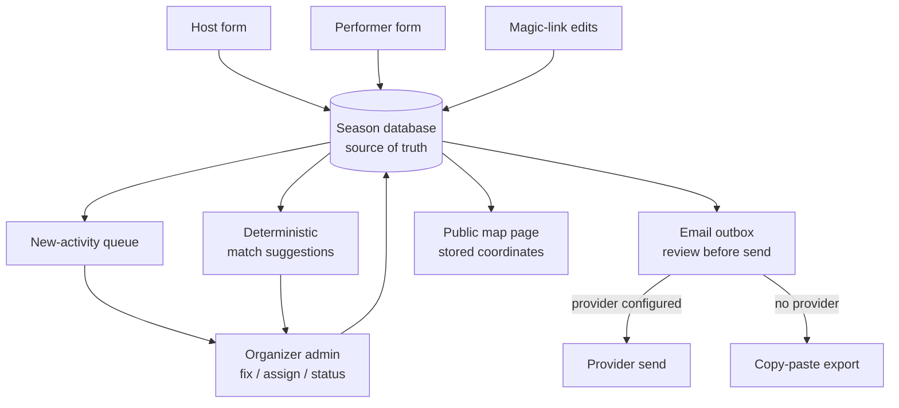
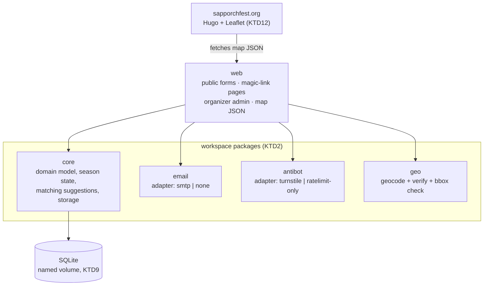
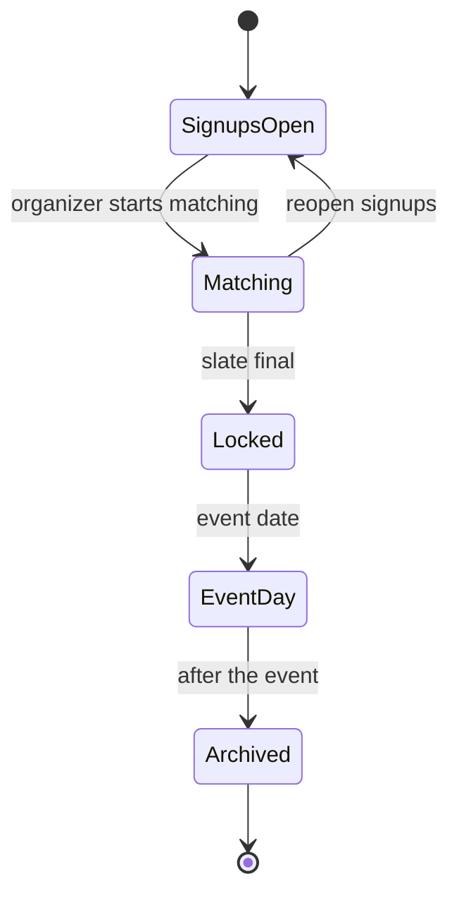
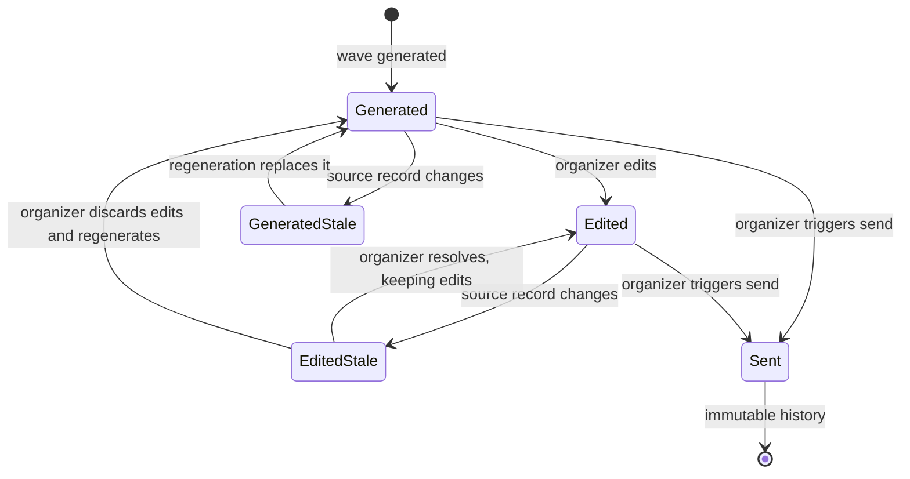

# Porchfest Platform - Plan

## Goal Capsule

- **Objective:** Organizers of SAP Porchfest — and any neighborhood that clones the repo — run a full porchfest season (signups → matching → emails → public map) from one self-hosted open-source platform. The 2027 SAP season is the first fully-native season; the fall-2026 post-event follow-ups are the shakedown.
- **Means:** A standalone FOSS repo, modular inside (workspace packages with clean seams), with woodshed's Show View as the pattern donor rather than a dependency. Milestone 1 is the custom map page for the 2026 event, fed by the existing Goal-1 pipeline.
- **Product authority:** Damien (sole organizer-owner; taste calls such as naming stay his).
- **Open blockers:** none.
- **Stop conditions:** invalidating evidence against any session-settled KD/KTD; any hard-block action (new runtime dependencies beyond the declared set, spend, sending live email to participants, prod-visible DNS/site changes) waits for Damien.
- **Tail ownership:** ce-work owns implementation and local verification; the KTD9 deploy gates block the SAP cutover until they pass; Damien triggers any live email send.

---

## Product Contract

### Summary

Build "run your own porchfest" as a standalone open-source platform: custom host and performer signup forms feeding a database that is the season's source of truth, a records-and-actions admin with organizer-reviewed matching, deterministic email wave generation with provider-pluggable sending, participant self-serve edits via magic links, and a public coordinate-accurate event map. SAP Porchfest is deployment #1.

### Problem Frame

The 2026 SAP season ran on two Google Forms, one master Google Sheet, hand-done matching, and manually cobbled emails and My Maps layers. Goal 1 (docs/plans/2026-08-19-001-sap-porchfest-goal1-plan.md) made one season deterministic — parse → match slate → rendered emails → geocoded map CSV — but it still orbits the Sheet, needs an AI-operated pipeline run for every update, and gives hosts and performers no way to see or fix their own data. Google's geocoder also scattered short addresses across St. Paul until explicit coordinates replaced it. The organizer experience to beat is concrete: a Tuesday night in June with eight new signups should take minutes — see them, fix a typo, assign a porch, trigger the right email — and none of it should require Google, a spreadsheet, or Damien personally.

### Key Decisions

- KD1. **Standalone FOSS repo, modular inside; extract shared packages only on proof.** Show View donates patterns (tiered router, outbox-with-review, magic links); no code is shared with woodshed at launch, and extraction waits until Porchfest and Show View are two working implementations of a seam. (session-settled: user-approved — chosen over extracting woodshed packages first and over building inside Show View: ships on the fall timeline with zero risk to live Hootenanny.) Governs R19, R20.
- KD2. **Stack-open portability: single-container Docker + SQLite is the reference deployment; no Cloudflare lock-in.** Cloudflare-specific pieces (Turnstile, Workers/D1) appear only behind adapters. (session-settled: user-directed — chosen over Cloudflare-first: end users choose their platform.) Governs R3, R12, R19.
- KD3. **Audience is organizers plus participant self-serve.** Multiple organizers administer; hosts and performers edit their own submissions via magic links. (session-settled: user-directed — chosen over organizer-only admin.) Governs R9, R14, R15.
- KD4. **Matching is organizer-decided with deterministic suggestions.** The platform surfaces explainable hints; a human assigns. No AI or network dependency in the core. (session-settled: user-approved — chosen over manual-only and over one-click auto-match.) Governs R7, R8.
- KD5. **Email is hybrid per deployment.** A configured provider enables platform sending and magic-link features; without one, the deployment degrades to copy-paste/export mode with those features off. (session-settled: user-directed — chosen over platform-always-sends: a FOSS deploy must work with zero email setup.) Governs R12, R14.
- KD6. **The platform goes live this fall by importing the 2026 season.** Post-event follow-ups run from it as the shakedown; the Goal-1 pipeline and Sheet stay canonical only through the Sept 16 event. (session-settled: user-directed — chosen over launching at the 2027 season: real data and a real send exercise the core months before it must carry signups.) Governs R23, R24.
- KD7. **Map beta ships this year as milestone 1; Google My Maps remains the 2026 map of record.** The custom page runs beside it, fed by Goal-1 pipeline data. (session-settled: user-approved — low risk one month before the event.) Governs R16, R18.
- KD8. **The admin is a records-and-actions surface, not a spreadsheet clone.** "Sheets-like" resolved in dialogue to: see new signups, fix fields, assign porches, trigger emails, handle withdrawals and renames. (session-settled: user-directed.) Governs R5, R6.
- KD9. **The repo and product are named `porchfest`; the SAP instance runs on Hetzner at `app.sapporchfest.org`.** (session-settled: user-directed — name chosen over `porchbox`/`openporch`; Hetzner chosen over the home box for always-on public availability.) Governs R19, R20.

<!-- ce-section: work-relationships -->
### How This Work Fits Together

This plan owns the standalone Porchfest platform, including this year's map beta. The surrounding breakdown is the current understanding, not a committed roadmap:

- **Goal-1 pipeline (`porchfest/` on this branch)** — Shares the data model and email templates; stays canonical through 2026-09-16, then becomes the import source (R23) and retires.
- **woodshed / Show View** — Pattern donor only. Hootenanny and the `old-guys-porchfest-2026` show stay on Show View; the two systems run side by side. Enables a later shared-package extraction, deliberately deferred (Scope Boundaries).
- **Standalone private repo `sapporchfest-site`** — Hosts milestone 1's map page; its hosts/performers pages later swap Google Forms links for platform form URLs. This is its own Git repository, not a tracked directory in the `websites` monorepo, and can proceed independently of the platform build.
- **Still to decide:** whether other woodshed-family apps ever consume extracted packages — revisit only after this platform and Show View coexist.

### Actors

- A1. Organizer — administers a season: reviews signups, matches, triggers emails. Several per deployment.
- A2. Host — offers a venue; edits own submission via magic link.
- A3. Performer — signs up an act; edits own submission via magic link.
- A4. Attendee — views the public map; needs no account.
- A5. Deployer — the person who stands up an instance for their neighborhood (often also A1).

### Requirements

**Signups and data**

- R1. Public host and performer signup forms capture at least the 2026 Google Forms' fields (venue address, contacts, space/power/rain/gear/drinks/amenities, notes; act name, contacts, duration, slots, amplification, genres, description, links, house preference, lend-gear).
- R2. Signups belong to a season; organizers open and close a season's signups.
- R3. Public forms carry pluggable anti-bot protection that fails closed when configured; an unconfigured deployment still gets rate limiting.
- R4. The database is the sole source of truth for a season's hosts, performers, venues, matches, and email history.

**Admin and matching**

- R5. The admin presents a new-activity queue plus full record lists. "New" is tracked per organizer, so one organizer working the queue never hides an item from another.
- R6. Organizers can edit any field, rename entities, and set statuses (tentative, confirmed, withdrawn) with the original submission preserved.
- R7. Organizers assign performers to venue time slots; the system blocks double-booking a slot, an act, or two acts that share a member, the last overridable only by an explicit organizer decision.
- R8. Assignment suggestions are deterministic, ranked, and explainable — mutual name requests, genre preference fit, gear/power compatibility, slot availability.
- R9. Admin auth supports multiple organizers without depending on any one cloud vendor's access product.

**Email**

- R10. Email waves (thank-you, match notification, reminder, day-of; the set is extensible per season) render deterministically from database fields — every contact, venue, and gear value byte-traceable to a record.
- R11. Generated messages land in a review-before-send outbox; organizers can edit; nothing transmits without an explicit organizer trigger.
- R12. Sending goes through a configurable provider adapter; with none configured, the outbox offers copy-paste/export instead.
- R13. Every send is recorded per recipient (wave, timestamp, outcome), including a record per recipient on multi-recipient messages.

**Participant self-serve**

- R14. Hosts and performers receive magic links to view and edit their own submission (available only when sending is configured, per KD5). Editable: their contact details, descriptive fields (act description, genres, links, gear, amenities), and a participant notes field of their own. Read-only: assignment, slot, status, coordinates, and organizer annotations.
- R15. Participant edits appear in the admin new-activity queue (R5); they never silently change a confirmed match.
- R33. Participants can submit a withdrawal, an availability change, or a venue-address correction as a *change request*. The request lands in the activity queue, and the confirmed assignment stands until an organizer applies or rejects it — these are the changes most likely to break a schedule, so self-serve must carry them rather than pushing them back to email.
- R34. A fresh deployment can open a usable season from the admin: event name and date, timezone, time slots, signup window and state, the neighborhood locality or bounding box that R17 checks against, public URLs, and organizer sender identity. Deploying successfully and still having no way to open a season is a failed install.
- R35. Contact data carries a deployer-configurable retention window and an organizer deletion or anonymization action, covering active records, archived seasons, annotations, send history, and off-host backups. Only the minimum needed for re-invites survives past the window.

**Public map and site**

- R16. The public map page renders performing venues from stored coordinates (owned by R29) — pin, acts, schedule, genre/links — regenerated from data. Publication is an explicit organizer act scoped to a season: the map serves nothing for a draft, future, or archived season, so a tentative assignment cannot make a home address globally enumerable months early. The host form states plainly that an accepted venue's address appears on the public map.
- R17. Geocoding produces organizer-verifiable coordinates with a neighborhood bounding-box sanity check, following the Goal-1 pattern.
- R18. Milestone 1: a 2026 map page ships on sapporchfest.org fed by Goal-1 pipeline data, beside the My Maps embed.

**Deployment and FOSS**

- R19. Reference deployment is a single Docker container with SQLite persistence, configured by env/file; docs let a non-expert deployer stand up an instance.
- R20. The repo is public open source (MIT) with docs sufficient for a stranger to run their neighborhood's porchfest.
- R21. One deployment carries successive seasons with per-season data separation.
- R22. No participant PII enters the repo or its images; instance data lives outside the code tree (Goal-1 lesson, standing). Published map data — venue address, act name, genre, description, and public links — is public by design and may be committed as generated map output; contact details, organizer annotations, and rendered messages never enter any repo.

**2026 migration (shakedown)**

- R23. The 2026 season imports from Goal-1 artifacts (parsed submissions, match slate, geocache) into the database this fall, preserving organizer annotations (basis, email notes, chase items) and recording provenance for contacts sourced from prior seasons.
- R24. At least the 2026 post-event follow-up emails run through the platform's outbox flow (send or copy-paste per KD5).

**Real-world states from the 2026 season and prior-system defects**

R25–R30 come from the 2026 season's own data. R31 and R32 come from the credentialed-lifetime and timestamp-CAS defects recorded on KTD8 and KTD7 — 2026 ran with a sole organizer and no magic links, so it could not have observed them.

- R25. A slot can be *held* for a named act that has not signed up, with an organizer-set decide-by date and an optional fallback venue. A held slot blocks assignment and stays off the public map. Passing the decide-by date makes the hold *releasable* and surfaces it to the organizer; it keeps blocking until an organizer releases it, and releasing offers the fallback as the assignment target. A hold may originate act-side — an act penciled to a venue that has not yet filed a host form.
- R26. Organizers can create a venue or act that has no submission of its own, recording how it is reached (through another party's contact, or a manually entered address). When that party later submits the real form, the organizer promotes the placeholder into it without losing matches or email history.
- R27. A resubmission is linked to its canonical record and marked superseded in either direction; a superseded record never reappears in the new-activity queue and never receives its own email.
- R28. A season moves through explicit states — signups open, matching, locked, event day, archived — and each state names which actions stay legal. Matching is legal while signups are open.
- R29. Coordinates carry their source (geocoded or organizer-verified). Regeneration never overwrites an organizer-verified coordinate, and editing an address marks its geocoded coordinate for re-verification instead of silently keeping a stale pin.
- R30. Every outbox message has a lifecycle: generated, edited, sent, or stale. Regeneration replaces generated messages, never edited or sent ones. A sent message is immutable history. Changing data behind an unsent message marks it stale rather than rewriting it, and changing a recipient's address clears that recipient's send state so a correction cannot be silently skipped.
- R31. Magic links expire, can be revoked, and are reissued on request. A link grants access only to its own record, and revocation follows withdrawal or supersession.
- R32. Concurrent organizer edits are resolved by compare-and-swap on the record; a write against a stale version is refused and names the conflict rather than overwriting.

### Key Flows

- F1. Season signup
  - **Trigger:** A2 or A3 submits a public form during an open season.
  - **Steps:** anti-bot check → record created → thank-you email queued (or queue-only in copy-paste mode) → appears in new-activity queue.
  - **Covers:** R1, R2, R3, R5, R10.
- F2. Match and notify
  - **Trigger:** A1 works the queue.
  - **Steps:** review suggestions → assign act to venue slot (double-booking blocked) → generate match-notification messages → review in outbox → send or export.
  - **Covers:** R7, R8, R10, R11, R12.
- F3. Participant self-correction
  - **Trigger:** A2/A3 opens their magic link.
  - **Steps:** edit own fields → change lands in DB and new-activity queue → organizer sees it; confirmed matches unchanged until an organizer acts.
  - **Covers:** R14, R15, R6.
- F4. Season turnover
  - **Trigger:** A1 archives a season / opens the next.
  - **Steps:** season closes → data retained per season → new season opens with fresh signups; prior-season records available for re-invites and suggestion history.
  - **Covers:** R2, R21.

### Acceptance Examples

- AE1. **Covers R12, R14.** Given a deployment with no email provider configured, when an organizer opens the outbox, then messages offer copy-paste/export only, and magic-link self-serve features are hidden platform-wide.
- AE2. **Covers R6, R16.** Given a matched performer withdraws, when the organizer sets status `withdrawn`, then the venue slot reopens, the act leaves the regenerated map, and no email history is lost.
- AE3. **Covers R7.** Given an act already assigned 6–7 pm at one venue, when an organizer assigns it 6–7 pm elsewhere, then the assignment is blocked with the conflict named.
- AE4. **Covers R6, R10, R16.** Given a host switches from front yard to back yard, when the organizer (or the host via magic link) edits that field, then subsequent emails and the map reflect it with no re-entry anywhere else.
- AE5. **Covers R3.** Given anti-bot is configured and its verify call fails or times out, when someone submits a public form, then the submission is refused (fail closed), matching the Show View precedent.
- AE6. **Covers R25, R26.** Given a slot held for a named act that never signed up, when the decide-by date passes, then the slot shows as releasable to the organizer, and releasing it reopens the slot without touching the venue's other assignments.
- AE7. **Covers R26.** Given a placeholder act reached through its host, when that act submits the real performer form, then the organizer can promote the submission into the placeholder, and the existing assignment and email history survive the promotion.
- AE8. **Covers R30.** Given a generated match message an organizer has edited but not sent, when the underlying venue record changes, then the message is marked stale with its edits intact, and regeneration leaves it alone until the organizer resolves it.
- AE9. **Covers R30, R13.** Given a message already sent to a recipient, when that recipient's address is corrected, then the sent record stays as history, the corrected address carries no send state, and the next wave treats the recipient as unsent rather than skipping them.
- AE10. **Covers R29, R17.** Given an organizer has verified a venue's coordinates by hand, when the map regenerates, then the verified coordinates are preserved; and when that venue's address is later edited, then the coordinate is flagged for re-verification instead of publishing a stale pin.
- AE11. **Covers R32.** Given two organizers open the same venue record, when the second saves against the version the first already replaced, then the write is refused and names the conflicting field rather than overwriting.

### Success Criteria

- The 2027 SAP season runs end to end with zero Google Forms, Sheets, or My Maps dependencies (owned by U12).
- The Tuesday-night test: eight new signups get reviewed, corrected, assigned, and emailed inside the admin in minutes, by an organizer who is not Damien.
- Fall shakedown passes: 2026 data imported and at least one real follow-up wave delivered through the platform.
- A stranger can deploy their own instance from the public repo and docs alone.

### Scope Boundaries

**Deferred for later**

- Shared-package extraction from woodshed (mix-and-match modules) — revisit once Porchfest and Show View coexist as two implementations.
- Cloudflare Worker/D1 deploy adapter; AI-assisted matching; multi-tenant hosted service ("porchfest-as-a-service"); attendee accounts or schedule features beyond the map.

**Outside this product's identity**

- A general-purpose event platform: Show View remains the multi-show guest-experience system for Damien's other shows; this product stays porchfest-shaped.
- Replacing the sapporchfest.org marketing site: the Hugo site stays the front door and links into the platform.

### Dependencies / Assumptions

- Goal-1 artifacts (`porchfest/out/submissions.json`, `porchfest/private/matches-2026.json`, `porchfest/private/geocache.json`) are the 2026 import source and remain reproducible from the raw Sheet export.
- The SAP deployment target is Hetzner behind `app.sapporchfest.org` (per KD9); the Hugo site stays the front door at sapporchfest.org.
- woodshed's seeded `old-guys-porchfest-2026` show (dated 2026-09-19, Show View) is a different event from SAP Porchfest (2026-09-16) and is untouched by this work; the date difference is verified in-repo.
- MIT licensing per Damien's standing default; third-party components logged per his THIRD-PARTY.md convention.

### Outstanding Questions

**Deferred to implementation** (none blocking)

- Exact import field mapping from the Goal-1 JSON shapes to the schema — settled by reading the artifacts during U10.
- Whether the suggestion ranking needs weight tuning after the first real season; the 2027 signup wave is the first honest test.
- Which additional email provider adapters ship after SMTP (Resend, SES, Mailgun) — driven by what deployers ask for.

### Sources / Research

- Goal-1 plan and pipeline: docs/plans/2026-08-19-001-sap-porchfest-goal1-plan.md, `porchfest/` (this branch).
- Show View pattern donors, verified with file:line evidence on 2026-08-20: tiered router with central module gating (showview/worker/src/router.js), fail-closed Turnstile session mint (showview/worker/src/sessions.js, rsvp.js:131), outbox with CAS revision and dry-run-default drain (showview/worker/migrations/0050_reminder_outbox.sql, scripts/hootenanny-send-reminders.py), portable root-app stack Node/Hono/SQLite/Drizzle/Docker (package.json, src/server.ts, drizzle.config.ts, Dockerfile).
- sapporchfest.org cutover surface: standalone private repo `sapporchfest-site`, with repo-relative `content/{map,hosts,performers}.md` (My Maps iframe + two Google Forms links), Hugo + Caddy Docker build.
- 2026 field inventory: the two Google Forms and the master workbook's 2026 tabs (22 host / 21 performer submissions), parsed in `porchfest/out/submissions.json`.
- Institutional learnings consulted during planning, each cited on the KTD it constrains: docs/solutions/workflow-issues/deploy-woodshed-without-touching-hootenanny.md, docs/solutions/logic-errors/email-correction-after-sent-at-stamp-silently-skips-invite.md, docs/solutions/integration-issues/credentialed-rows-need-a-bounded-lifetime.md, docs/solutions/logic-errors/purge-once-lifecycles-need-reentry-and-terminal-narrowing.md, docs/solutions/logic-errors/timestamp-cas-needs-millisecond-tokens-and-sql-enforcement.md, docs/solutions/integration-issues/fail-open-checks-must-never-persist-their-verdict.md, docs/plans/2026-08-02-003-feat-reaching-every-guest-plan.md.

**Product Contract preservation:** restructured, no scope change. R13, R16, and R23 gained qualifiers naming behavior the origin implied; R25–R32 and AE6–AE11 were added from flow analysis against the real 2026 data. No requirement was weakened, narrowed, or reclassified, and every KD keeps its original `Governs` links.

---

## Planning Contract

### Key Technical Decisions

- KTD1. **Node 24 + TypeScript + Hono + Drizzle/SQLite in one container, mirroring woodshed's root app.** The stack is already proven portable in this family (package.json, src/server.ts, drizzle.config.ts, Dockerfile) and runs on any host, which is what KD2 requires. Governs R19; implements KD2.
- KTD2. **npm workspace packages with adapter seams: `core` (domain + storage), `web` (HTTP + UI), `email` (provider adapters), `antibot` (challenge adapters), `geo` (geocoding + verification).** Seams exist from the first commit so a later extraction is mechanical rather than archaeological. `core` declares the email and geo adapter interfaces as ports and receives implementations by injection from `web`'s composition root, so no import ever leaves `core` toward an adapter package. The three donor patterns each live in their own internal module with a declared interface and no imports from sibling domain modules — `core/src/outbox/`, `core/src/tokens/`, `web/src/router/` — and those modules are the extraction units this seam buys. (session-settled: user-approved — chosen over a single flat app and over extracting woodshed packages first: keeps the mix-and-match future open without paying for it now.) Implements KD1.
- KTD3. **Server-rendered HTML with progressive enhancement; no SPA framework.** An organizer admin of this size does not need a client runtime, and server rendering keeps the FOSS deploy a single process. Each admin JS module no-ops when its container element is absent — woodshed shipped one bundle on every page, so an admin-only script error broke the public guest flow (docs/plans/2026-08-02-003-feat-reaching-every-guest-plan.md). Governs R5, R19.
- KTD4. **Email adapters are SMTP first; hosted-API providers come later; no Gmail-API server sending.** woodshed kept Gmail sending as a local drain precisely because a Testing-status grant expires about every seven days and a server-side send would fail silently in whichever week it lapsed. Governs R12; implements KD5.
- KTD5. **The outbox stores the exact payload that will be sent — subject, HTML body, text body — and never re-derives a field at send time.** Deriving at send re-renders after the last organizer edit and silently discards it. Message state is `generated | edited | sent | generated_stale | edited_stale` — staleness must remember whether an organizer had edited the row, or the state alone cannot say whether regeneration may replace the body. Every edit and regenerate write carries `AND sent_at IS NULL`; regeneration replaces `generated` and `generated_stale` rows and never touches `edited` or `edited_stale`, which wait for the organizer to resolve them (AE8). Governs R11, R30.
- KTD6. **Send state is per recipient and keyed to the address it was sent to; correcting an address clears that recipient's send state.** woodshed's `sent_at` was decoupled from the address, so a corrected email was skipped forever while the run reported success (docs/solutions/logic-errors/email-correction-after-sent-at-stamp-silently-skips-invite.md). Keep the previous address so a bounce sweep reports "corrected — needs resend". Stamp before transmitting is wrong in the other direction; stamp immediately after a verified send and reconcile on restart. Governs R13, R30.
- KTD7. **Optimistic concurrency is enforced inside the mutation, keyed on an integer `version`** — `UPDATE … WHERE id = ? AND version = ?`, the statement incrementing `version`, verdict taken from the affected-row count. A timestamp is *not* the token: two writes inside one millisecond can carry the same stamp, so the winning write reproduces the token the loser expects and both succeed — the donor learning records that as an accepted residual, and this plan does not accept it (docs/solutions/logic-errors/timestamp-cas-needs-millisecond-tokens-and-sql-enforcement.md). `updated_at` stays as audit metadata only. A SELECT-compare-write version of this passed a 234-test suite twice while being wrong, so the tests must exercise behavior against a real database with the clock pinned, not scan source. Governs R32.
- KTD8. **Rendered outbox rows and magic-link tokens are credentialed data with a bounded lifetime.** Tokens are stored hashed with an expiry; rendered bodies containing links are purged when their wave completes, with the purge shipped in the same change that creates the rows. The purge check runs on every relevant call rather than once at the last send, and its destructive statement is narrowed to terminal rows so a concurrent regeneration is not destroyed (docs/solutions/integration-issues/credentialed-rows-need-a-bounded-lifetime.md, docs/solutions/logic-errors/purge-once-lifecycles-need-reentry-and-terminal-narrowing.md). Admin and participant responses carry `Cache-Control: no-store, private`. Governs R14, R31.
- KTD9. **Deployment pins the data volume by name and proves data survival before declaring success.** A changed Compose project name or invocation path silently attaches a fresh volume and the app comes up healthy and empty. The deploy gate is: same named volume, SQLite `integrity_check` passes, row counts match pre- and post-deploy, a quiesced full-volume archive exists, and the prior image tag is retained for rollback (docs/solutions/workflow-issues/deploy-woodshed-without-touching-hootenanny.md). Archives hold every neighbor's contact record, so they are written outside any served directory, mode `0600`, owned by the deploy user, with only the last N retained. **Local archives are not a backup** — the volume and its archives share one failure domain, so an encrypted copy goes off-host with a stated retention and RPO, and the gate is a *successful restore on a clean machine*, never the mere existence of an archive. **Rollback is two paths, not one:** an image-only rollback is valid solely when the retained image understands the current schema; when boot-time migrations have moved it, rollback restores the matching quiesced archive first. Both paths are rehearsed. Governs R19, R21, R22.
- KTD10. **Anti-bot is an adapter with a working no-configuration default.** Turnstile is the first adapter, following Show View's proven mint shape: server-generated ids in signed cookies, single-use token hashes, per-IP caps, fail closed. With no adapter configured the deployment still gets per-IP rate limiting plus a honeypot field, so an unconfigured FOSS deploy is not defenceless. The client IP comes from a configured trusted-proxy hop count (default: the socket peer address), and `X-Forwarded-For` is ignored unless that count is set — behind a reverse proxy a naive reading either throttles all traffic as one client or lets a spoofed header bypass the cap entirely. A challenge that cannot be reached is a refusal, never a stored verdict (docs/solutions/integration-issues/fail-open-checks-must-never-persist-their-verdict.md). Governs R3.
- KTD11. **Coordinates carry provenance and organizer-verified wins.** The `geo` adapter prefers parcel-level address points, rejects street-level geocoder results outright, and stores `source`, `ref`, and house-level cross-check distance with every coordinate. Its verification gate refuses interpolated coordinates rather than trusting a plausible point. Geocoding writes `geocoded`; an organizer's correction writes `verified`; regeneration overwrites only `geocoded` rows. An address edit sets the coordinate's status to needs-review rather than orphaning or silently keeping it. This generalizes the Goal-1 geocache, which was keyed by address string and hard-failed on any edit. Governs R29, R16, R17.
- KTD12. **Milestone 1's map page is a static Hugo page plus a generated JSON file in the standalone `sapporchfest-site` repo, using Leaflet with OpenStreetMap tiles.** It ships without waiting for the platform and without an API key. The platform later serves the same JSON shape, so the page survives the cutover unchanged. (session-settled: user-approved — chosen over building milestone 1 inside the platform: ships in days, beside the working My Maps embed.) Governs R18; implements KD7.
- KTD14. **Transport is HTTPS, cookies are hardened, and every mutation carries CSRF protection.** TLS termination is a documented host-level prerequisite (Caddy, or whatever the deployer already runs) rather than a second service inside the reference Compose project, which keeps KD2's one-container contract intact; the app redirects plain HTTP and sets every session and magic-link cookie `Secure; HttpOnly; SameSite=Lax`. **`SameSite=Lax` is not the CSRF boundary here** — `sapporchfest.org` and `app.sapporchfest.org` are same-site, so a compromise of the marketing origin could submit cookie-authenticated writes, the wave-send trigger being the highest-value target. Every non-safe method therefore validates an exact configured `Origin`, carries a CSRF token on server-rendered forms, and refuses simple cross-origin content types, following the donor router's central rejection rather than per-handler checks. Governs R9, R11, R14, R19, R31.
- KTD16. **One canonical external origin, one canonical route registry.** A configured `PUBLIC_BASE_URL` is required whenever email or magic links are enabled, and every outbound link, bootstrap URL, and reissue link is built only from it — constructing links from the request `Host` lets an attacker send a participant a magic link pointing at their own domain, and TLS on the real origin does not prevent it. Unrecognized `Host`/`X-Forwarded-Host` values are refused after trusted-proxy processing. Separately, every route declares its trust tier — public, participant, or organizer — in one central registry that fails closed on a missing or unknown tier, so a forgotten per-handler guard cannot expose the control plane. Governs R3, R9, R14, R31.
- KTD15. **Each deployment generates its own secrets; no secret ships in the repo.** The session and token-hashing key is generated into the data volume on first boot when unset, and the app refuses to start if the configured value equals the `.env.example` placeholder. Provider credentials (SMTP password, anti-bot secret key) are read from env or a mounted file, never logged, never baked into an image. A shared default key in a public repo would let anyone forge an organizer session against any deployment, including SAP's. Governs R19, R20, R9.
- KTD13. **The 2026 import is a one-way, idempotent command keyed on stable natural keys from the Goal-1 artifacts.** Re-running it must not duplicate records; organizer prose (`basis`, `email_notes`, `chase`) imports into annotation fields rather than being dropped, and contacts sourced from 2025 tabs carry a provenance note satisfying R23. Governs R23.

### High-Level Technical Design

Season state machine (R28) — the states that decide which actions stay legal:

The actions each state permits (R28's contract):

| State | Public signup | Assignment | Record correction | Wave generation and send |
|---|---|---|---|---|
| Signups open | Yes | Yes | Yes | Yes |
| Matching | Yes | Yes | Yes | Yes |
| Locked | No | No | Yes | Yes |
| Event day | No | No | Yes | Yes |
| Archived | No | No | No | Yes |

Matching and open signups coexist deliberately — the 2026 season matched on a rolling basis and added acts afterwards, so `Matching` marks that the organizer has started assigning, not that the door is shut. Locked closes assignment and new signups but never correction. Archived keeps the outbox usable for follow-ups (R24).

Outbox message lifecycle (R30, KTD5):

### Assumptions

- The 2027 SAP signup season opens around May, so the platform must carry public forms by spring; the fall shakedown is the intermediate proof, not the deadline.
- Deployers are comfortable running one container and editing an env file; they are not expected to operate a database server, which is why SQLite is the reference store.
- Participant volume stays in the low hundreds per season, so SQLite with a single writer is ample and no queue is warranted.

### Sequencing

Four phases. **Phase 1** (U1) ships the 2026 map beside My Maps; it depends on nothing else and can run alongside Phase 2. **Phase 2** (U2, U3, U5, U6, U7) builds the shakedown path — scaffold, schema, admin, assignment, outbox. **Phase 3** (U9–U11) serves the platform's own map data, imports 2026, deploys to Hetzner, and runs the shakedown. **Phase 4** runs in order — U4 (public forms and the anti-bot adapter), then U8 (self-serve, which reuses that adapter), then U12 (site cutover) — dated to the 2027 signup opening around May.

U4 and U8 sit in Phase 4 rather than blocking the fall: 2026 signups are closed so no public form is exercised, and self-serve is off in the copy-paste mode the shakedown runs in. Neither is on the shakedown critical path; both must land before spring.

The Hetzner box is stood up as soon as the U2 scaffold exists — literal named volume, TLS, its own Compose project — and redeployed after each subsequent unit, so KTD9's data-survival gate is routine long before U11's deploy carries real neighbor data.

---

## Implementation Units

### U1. 2026 map page on sapporchfest.org

- **Status:** Complete and verified (implementation); the standalone site's commits remain unpushed and undeployed pending Damien's decision.
- **Goal:** A coordinate-accurate Porchfest map on the marketing site, fed by Goal-1 data, live beside the My Maps embed.
- **Requirements:** R16, R17, R18. Implements KD7 via KTD12.
- **Dependencies:** none.
- **Target repo:** standalone private repo `sapporchfest-site` (`github.com/damienriehl/sapporchfest-site`, default branch `main`), normally checked out at `~/Coding Projects/websites/sites/sapporchfest-site`; it is not part of the `websites` monorepo.
- **Files:** in `sapporchfest-site`, repo-relative `content/map.md`, `layouts/shortcodes/porchfest-map.html`, `static/js/porchfest-map.js`, `static/data/venues-2026.json`, `static/data/venues-map.v1.schema.json`, `static/data/venues-map.v1.sha256`, and `tools/verify-map-data.py`; in this repo, `porchfest/tools/render.py`, `porchfest/tools/verify.py`, `porchfest/schemas/venues-map.v1.schema.json`, `porchfest/schemas/venues-map.v1.sha256`, and `porchfest/schemas/README.md`.
- **Approach:**
  1. Extend the Goal-1 renderer to emit `venues-2026.json` in a **structured** shape — one object per venue with `title`, `address`, `lat`, `lng`, `schedule`, and an `acts` array whose entries carry `slot`, `slot_label`, `name`, `genre`, `description`, `links: [{label, url}]`, and an optional free-text `note`. The source `listen` and `websites` fields are messy free text, not URL columns: extract each HTTP(S) URL into `links`, retain the non-URL residue in `note`, and drop pure placeholders such as `n/a`, `none`, and `-`. Do not reuse the flattened My Maps CSV rows, which collapse two acts into one display string and lose per-act slots.
  2. Make **one** versioned JSON Schema the canonical artifact — two independently owned copies are two authorities that can each drift with their own implementation while both suites stay green. The producer owns `venues-map.v1.schema.json` at `schema_version` 1.1.0 and its `.sha256` pin; the consumer carries byte-identical copies, and each side asserts the digest before validating data. Contract changes begin in the producer and update the schema and pin together; the site-cutover gate re-checks compatibility.
  3. Add a Leaflet + OpenStreetMap shortcode that reads the JSON, drops one marker per venue, and renders a popup carrying each act, its slot, genre, and links. Set the standard OpenStreetMap contributor attribution on the tile layer, and record Leaflet and the tile source per the THIRD-PARTY convention.
  4. Handle the non-success states: a loading placeholder, an empty state when no venue has an act, and a visible fetch-failure message pointing at the My Maps embed below.
  5. Keep the existing My Maps iframe on the page below the new map, labelled as the current official map, until Damien decides to swap them.
  6. Match the site's existing type and color treatment; the page must be legible on a phone at the event.
- **Patterns to follow:** the site's shortcode-plus-static-script pair `layouts/shortcodes/faq-toggle.html` + `static/js/faq-toggle.js` (the site has no `partials/` directory and no Hugo Pipes usage); the map column contract in `porchfest/tools/render.py`.
- **Execution note:** `porchfest/` has no pytest or separate unit-test harness. `bash porchfest/tools/run_all.sh` drives the Python pipeline, and `porchfest/tools/verify.py` is the producer-side assertion harness for the scenarios below.
- **Test scenarios:**
  - Covers R16. Every performing venue in the 2026 slate renders exactly one marker; venues with no act render none.
  - Covers R18. The generated JSON parses and carries a numeric latitude and longitude for every row.
  - A venue with two acts shows both, with their time slots, in one popup.
  - Every marker's coordinates fall inside the Saint Anthony Park bounding box (the Goal-1 check, re-asserted on the JSON).
  - The generated JSON validates against the pinned canonical schema version.
  - A failed JSON fetch renders the failure message rather than an empty grey box.
  - The page renders with no console errors at a 375px viewport.
- **Verification:** the local Hugo build serves a map whose pins sit in Saint Anthony Park, popups carry the right acts, and the My Maps embed still renders below it.

### U2. Repo scaffold, workspace seams, and CI

- **Goal:** A public `porchfest` repo whose package boundaries and test harness exist before any feature lands.
- **Requirements:** R19, R20. Implements KD1, KD2 via KTD1, KTD2.
- **Dependencies:** none.
- **Target repo:** `porchfest` (new).
- **Files:** `package.json`, `tsconfig.json`, `drizzle.config.ts`, `packages/core/`, `packages/web/`, `packages/email/`, `packages/antibot/`, `packages/geo/`, `Dockerfile`, `compose.yaml`, `.env.example`, `README.md`, `LICENSE`, `THIRD-PARTY.md`, `.github/workflows/ci.yml`, `vitest.config.ts`, `eslint.config.js`.
- **Approach:** **create the repo in a sibling checkout outside woodshed** — this tree already contains a `porchfest/` directory holding the Goal-1 pipeline and, under gitignore, real neighbor contact data; initializing the public repo there would make the privacy boundary depend on local ignore state. Copy only an explicit allowlist of public-safe files from Goal 1 (templates, tool logic), and add a clean-room scan that fails if raw exports, `private/`, `out/`, or generated messages ever enter its history or an image. Then mirror woodshed's root-app stack (KTD1) as npm workspaces (KTD2). `core` owns the domain and storage and declares adapter ports; `web` depends on `core` and injects adapter implementations; each adapter package exports one interface with a null/no-op implementation so the app runs unconfigured. The central route registry and default-deny trust tiers from KTD16 land here, before any route exists to forget a guard. Compose pins the data volume by literal name and fronts the app with TLS-terminating Caddy per KTD9 and KTD14. **Invert two things when copying the donor Dockerfile:** it runs `npm ci --workspaces=false` and copies only root-app paths into the runtime stage, which would ship an image containing none of the five packages — install all workspaces and copy `packages/` in, while keeping the donor's builder/runtime split, native better-sqlite3 build, non-root user, named `/data` volume, and healthcheck. Secrets follow KTD15; `.env.example` ships placeholders only.
- **Patterns to follow:** `package.json`, `tsconfig.json`, `Dockerfile`, and `drizzle.config.ts` in this repo's root app.
- **Test scenarios:**
  - Test expectation: scaffolding only — the suite proves the harness runs and the app boots with an empty config, no domain behavior yet.
  - The container starts with no environment variables set and serves a health endpoint.
  - Covers KTD15. Two fresh boots with no configured secret generate different keys, and a boot whose configured secret equals the `.env.example` placeholder refuses to start.
  - Covers KTD2. The built image contains all five workspace packages; the CI dependency-graph check fails if `core` imports an adapter package; a composition-root substitution test swaps an adapter implementation without touching `core`; every adapter port has a shared contract suite its implementations pass. (Packaging alone is not the seam — a tightly coupled build would also ship five directories.)
  - Covers KTD16. A route registered without a trust tier fails closed rather than defaulting to reachable.
  - Covers R22. The clean-room scan refuses a commit or image carrying raw exports, `private/`, `out/`, or generated message bodies.
- **Verification:** `npm test` and `npm run typecheck` pass; `docker compose up` serves health on a fresh machine.

### U3. Schema, season state machine, and record lifecycle

- **Rebaselined 2026-08-23 (owner-approved):** record *creation* was never assigned to any unit — U3 built the lifecycle, U5 covers organizer placeholders, U10 covers import — so U4 was dispatched against a `core` that had no way to create a record and correctly came back blocked. Creation is now explicitly in U3's scope and was implemented in `cd2c975`: `createHostSignup` / `createPerformerSignup` on the season repository, each wrapping the legality check and the delegated write in one `db.transaction(..., { behavior: "immediate" })` over the `CoreExecutor` seam.
- **Goal:** The database that is the season's source of truth, including the real-world states the 2026 season proved.
- **Requirements:** R1, R2, R4, R6, R21, R25, R26, R27, R28, R32.
- **Dependencies:** U2.
- **Files:** `packages/core/src/schema.ts`, `packages/core/src/season.ts`, `packages/core/src/records.ts`, `packages/core/drizzle/` (generated by `drizzle-kit generate` from `schema.ts` and applied programmatically at boot, mirroring the donor's `src/db/index.ts`), `packages/core/test/season.test.ts`, `packages/core/test/records.test.ts`.
- **Approach:**
  1. Model seasons, venues, acts, contacts, slots, assignments, and annotations; every row is season-scoped (R21).
  2. Give slots the three states R25 requires — open, held (with decide-by and held-for name), assigned.
  3. Give venues and acts a `placeholder` flag with a reach-via reference (R26) and a promotion path that re-points assignments and email history to the promoted record.
  4. Implement supersession as a canonical pointer in either direction (R27), excluded from the activity queue.
  5. Enforce the season state machine as legal-action checks in the domain layer, not in the UI.
  6. Every mutating repository function takes an expected integer `version` and enforces it in the UPDATE, incrementing it in the same statement (KTD7).
- **Execution note:** implement the CAS guard test-first — this is the defect class that passed a large suite twice while being wrong; assert behavior against a real SQLite file, never by scanning source.
- **Test scenarios:**
  - Covers R32 / AE11. A write with a stale `version` is refused, the stored row is unchanged, and the refusal names the conflict.
  - Covers R32 / KTD7. With the clock pinned so both writes stamp the same millisecond, the second write is still refused — the guarantee a timestamp token cannot make.
  - Covers R25 / AE6. Holding a slot blocks assignment; releasing reopens it; a hold past its decide-by is reported as releasable without auto-releasing silently, and a hold carrying a fallback offers it as the release target.
  - Covers R26 / AE7. Promoting a placeholder act into a real submission preserves its assignment and its email history.
  - Covers R27. A superseded record is excluded from the activity queue and from email recipient resolution.
  - Covers R28. Assignment is legal while signups are open; assignment in a locked season is refused; correction in a locked season is allowed.
  - Covers R21. A season's activity queue, assignments, suggestions, and email waves never include another season's rows.
  - Covers R21 / F4. An explicit cross-season lookup returns a prior season's contact for re-invite, with its source season recorded.
- **Verification:** the season and record suites pass against a real SQLite file, including the concurrency cases.

### U4. Public signup forms and anti-bot adapter

- **Rebaselined 2026-08-23 (owner-approved):** U4 takes the season **timezone** field that R34 assigns to U5's first-run setup, because participant availability arrives as a timezone-free wall clock and reading it as UTC stores the wrong instant. `seasons.timezone` (migration `0004`, default `UTC`) and `zonedWallClockToUtc` land here; U5's first-run setup edits the column rather than introducing it.
- **Goal:** Hosts and performers sign up through the platform, with anti-bot protection that degrades honestly.
- **Requirements:** R1, R3, R5, and the timezone half of R34. Implements KTD10.
- **Dependencies:** U3, including its rebaselined record-creation scope.
- **Files:** `packages/antibot/src/index.ts`, `packages/antibot/src/turnstile.ts`, `packages/antibot/src/ratelimit.ts`, `packages/web/src/routes/signup.ts`, `packages/web/src/views/host-form.ts`, `packages/web/src/views/performer-form.ts`, `packages/antibot/test/turnstile.test.ts`, `packages/web/test/signup.test.ts`.
- **Approach:** carry every 2026 Google Form field (R1). The anti-bot adapter interface returns pass, fail, or unavailable; unavailable is a refusal and stores nothing (KTD10). With no adapter configured, per-IP rate limiting plus a honeypot still applies, with the client IP resolved per KTD10's trusted-proxy rule. Follow Show View's mint shape for single-use tokens and per-IP caps. Participant text is stored raw and escaped at every render site (admin, outbox HTML and text, map popup); URL-typed fields accept only `http`/`https` schemes. Any rejected submission — validation or anti-bot — re-renders the form with every submitted value intact and the failing field named inline, since a phone-typed venue form is long and losing it means losing the signup. A successful submission renders a confirmation stating what happens next, and says plainly when no confirmation email will follow.
- **Test scenarios:**
  - Covers R3 / AE5. A configured challenge that times out refuses the submission and persists nothing.
  - Covers R3. A replayed challenge token is refused on its second use.
  - Covers R3. With no adapter configured, a burst from one IP is rate-limited and a honeypot-filled submission is dropped.
  - Covers R1. A submission carrying every form field round-trips into the database with values intact, including multi-select gear and amenity fields.
  - Covers R5. A new submission appears in the activity queue.
  - A submission missing a required field is rejected with a message naming the field, and every other value the submitter typed survives the round trip.
  - A description and links field carrying markup and a `javascript:` URL render as inert text in the admin, the outbox body, and the map JSON, and the non-http scheme is rejected at submit.
  - Covers KTD10. With proxy trust unset, a spoofed `X-Forwarded-For` does not reset the per-IP cap.
  - A successful submission renders the confirmation page, including the no-email notice when no provider is configured.
- **Verification:** both forms submit end to end against a local instance with and without an anti-bot adapter configured.

### U5. Organizer admin: queue, records, first-run setup, and field edits

- **Goal:** The Tuesday-night surface — open a season, see new signups, fix a typo, change a status.
- **Requirements:** R5, R6, R9, R15, R26, R27, R32, R33, R34, R35. Implements KD8 via KTD3.
- **Dependencies:** U3.
- **Files:** `packages/web/src/routes/admin.ts`, `packages/web/src/views/admin-queue.ts`, `packages/web/src/views/admin-record.ts`, `packages/web/src/auth.ts`, `packages/web/assets/admin.js`, `packages/web/test/admin.test.ts`, `packages/web/test/auth.test.ts`.
- **Approach:** server-rendered pages with progressive enhancement (KTD3); admin JS no-ops when its container is absent. **Organizer auth does not depend on the email adapter** (R9): on first boot with no organizer account the container prints a single-use bootstrap login URL to its logs, and an authenticated organizer invites others by copying a generated link when no provider is configured — emailed delivery is the enhancement, not the requirement. AE1's "hidden platform-wide" scopes to participant self-serve routes only. Bootstrap and invite links are themselves bearer credentials to the whole contact database, so they are high-entropy, stored hashed, short-TTL, consumed atomically once, audited on redemption, and every outstanding bootstrap link expires the moment the first organizer exists. Organizer accounts can be deactivated by another organizer, which immediately invalidates that organizer's sessions and outstanding invites; sessions carry a bounded absolute lifetime. **First-run setup (R34)** walks an empty database through event name, date, timezone, slots, signup window and state, locality bounding box, public URLs, and sender identity, ending in a season that can accept a public signup. The admin also owns the organizer-facing lifecycle actions the domain layer models: creating a placeholder, promoting a submission into one, and reconciling a resubmission in either direction (R26, R27), each CAS-protected and preserving assignments and email history. Participant change requests (R33) arrive in the queue as approve-or-reject items. Retention and deletion (R35) are organizer actions here. The record editor submits the row's `version` so KTD7's guard applies, and a refused stale-version save re-renders the form with the organizer's attempted values preserved beside the conflicting stored value, offering a re-save against the refreshed token. Every admin response carries `Cache-Control: no-store, private` (KTD8) and cookies follow KTD14.
- **Test scenarios:**
  - Covers R5. The queue shows new submissions and participant edits since that organizer's last review, and an explicit dismiss clears the item for that organizer only — a second organizer still sees it.
  - Covers R6 / AE4. Editing a venue field persists it and leaves the original submission readable.
  - Covers R6 / AE2. Marking an act withdrawn reopens its slot and leaves its email history intact.
  - Covers R9. An unauthenticated request to an admin route is refused; a second organizer can be invited and can sign in.
  - Covers R9. With no email provider configured, an organizer signs in via the bootstrap URL and reaches the queue; a second bootstrap attempt after the first organizer exists is refused.
  - Covers R9. A deactivated organizer's existing session is refused on its next request.
  - Covers R9. A bootstrap or invite link is single-use — a replayed redemption, an expired link, and two concurrent redemptions all fail, and outstanding bootstrap links die when the first organizer is created.
  - Covers KTD14. A cookie-authenticated write originating from the sibling marketing site, and from an unrelated origin, are both refused.
  - Covers R34. An empty database goes through first-run setup to a season that accepts a public signup.
  - Covers R26, R27. An organizer creates a placeholder, promotes a real submission into it, and reconciles a resubmission, each preserving assignments and email history.
  - Covers R33. A participant change request appears in the queue; the confirmed assignment holds until the organizer applies it.
  - Covers R35. Deleting a participant removes their contact fields from active records, archives, annotations, and send history, leaving only non-identifying matching history.
  - Covers R32 / AE11. A stale-version save surfaces the conflict in the UI rather than overwriting.
  - Covers R15. A participant edit lands in the queue and does not alter a confirmed assignment.
  - The admin JS bundle loads on a public page without error when no admin container is present.
- **Verification:** an organizer **other than Damien** completes the Tuesday-night loop unaided — review, correct, set a status — against a local instance.

### U6. Assignment, deterministic suggestions, and season state transitions

- **Rebaselined 2026-08-24 (owner-approved):** the organizer surface for **season
  state transitions** was never assigned to any unit. U3 built the state machine
  in the domain layer and explicitly kept it out of the UI; U5's scope is the
  queue, records, first-run setup, and field edits. So R28's states and F4's
  "Season turnover" flow had no implementing unit, and a 2026-08-24 UAT confirmed
  the consequence: no route calls `transitionSeason`, so an organizer cannot close
  signups, lock a season, or archive one. Retention's premise ("after a season
  closes") and the archived read-only record page were both unreachable. Damien's
  call on the `uat-findings` sheet: **U6 owns it**, because closing signups and
  locking are exactly when assignment work makes them matter. Same class of gap,
  and same resolution, as the record-creation rebaseline recorded in U3.
- **Goal:** Organizers assign acts to slots with explainable hints and no double-booking, and move a season through its states.
- **Requirements:** R1, R7, R8, R25, R28. Implements KD4.
- **Dependencies:** U3, U5.
- **Files:** `packages/core/src/matching.ts`, `packages/web/src/routes/assign.ts`, `packages/web/src/routes/season-lifecycle.ts`, `packages/web/src/views/assign-venue.ts`, `packages/web/src/views/assign-act.ts`, `packages/core/test/matching.test.ts`, `packages/web/test/assign.test.ts`, `packages/web/test/season-lifecycle.test.ts`.
- **Approach:** suggestions are pure functions over season data — mutual name requests first, then genre preference fit, gear and power compatibility, slot availability. Every suggestion returns its reasons so the UI can show why. Assignment refuses conflicts (R7) and honors holds (R25). **Shared members are modelled explicitly:** the performer form has captured "is your band member in another SAP Porchfest band, too?" since 2026 precisely so a drummer in two acts is not booked into one slot twice — link the acts, surface the link in both views, and refuse the same-slot assignment unless an organizer records an override. Two views share the one engine: venue-first (a venue, its slots, ranked candidate acts) is the primary screen and matches how the 2026 season was worked, porch by porch; act-first (an act, its ranked candidate slots) covers the leftover-act pass at the end of matching. Each shows the top-ranked candidates with their reasons beside the assign action, not hidden behind a hover.
- **Test scenarios:**
  - Covers R7 / AE3. Assigning an act to a slot it already occupies elsewhere is refused and names the conflict.
  - Covers R7. Assigning a second act to a filled slot is refused.
  - Covers R7 / R1. Two acts sharing a member cannot be assigned to the same time slot without an explicit organizer override, and the override is recorded.
  - Covers R8. A host who named a band and a band who named that host rank each other first.
  - Covers R8. An amplified act is not suggested for a venue without power ahead of an acoustic one.
  - Covers R8. Suggestions are stable — the same season data produces the same ranking.
  - Covers R8. Every returned suggestion carries at least one human-readable reason.
  - Covers R25. A held slot is excluded from suggestions until released.
  - Covers R8. The venue-first and act-first views return the same ranking and reasons for the same pairing.
  - Covers R28 / F4. An organizer moves a season through its states from the admin, each transition names what it will stop allowing before it is taken, and an illegal transition is refused by name rather than by a bare error.
  - Covers R28. Archiving a season makes its record pages read-only, which is the state the archived-record rendering already shipped for and could not previously be reached.
- **Verification:** suggestions run against a checked-in fixture season produce stable, reason-carrying rankings. The imported-2026 fidelity claim belongs to U10 and the Verification Contract's 2026-fidelity gate.

### U7. Email waves, outbox, and provider adapters

- **Goal:** Deterministic wave generation into a review-before-send outbox that either sends or exports.
- **Requirements:** R10, R11, R12, R13, R24, R30. Implements KD5 via KTD4, KTD5, KTD6.
- **Dependencies:** U3, U5.
- **Files:** `packages/email/src/index.ts`, `packages/email/src/smtp.ts`, `packages/email/src/none.ts`, `packages/core/src/waves.ts`, `packages/core/src/outbox.ts`, `packages/web/src/routes/outbox.ts`, `packages/web/src/views/outbox.ts`, `packages/core/test/waves.test.ts`, `packages/core/test/outbox.test.ts`, `packages/email/test/smtp.test.ts`.
- **Approach:** port the Goal-1 templates (`porchfest/templates/`) as the seed wave set — thank-you, match notification, 7-day reminder, day-of — **plus a post-event follow-up wave**, since that is the wave the fall shakedown actually sends and porting only the four would leave Phase 3 exercising SMTP with an undefined message. Organizers can author an ad-hoc wave with its own recipient selection and editable body. Rendering reads only database fields so every value is traceable (R10). The stored row is the payload — subject, HTML, text — never re-derived at send (KTD5). The organizer edits the plain-text body; the HTML is generated from that edit at edit time and both are stored, so a typo is fixed once and the two bodies cannot drift. The outbox is a wave-level review surface: the whole wave renders as one list, the organizer selects all or some, and one trigger sends the selection. Copy-paste mode offers the same selection as a whole-wave export, not only per-message copies. Message state and its transitions follow R30; regeneration touches only `generated` rows; every edit and regenerate write carries `AND sent_at IS NULL`. Send state is per recipient and per address (KTD6). Rendered bodies carrying magic links are purged when their wave completes (KTD8): the completion check runs on every outbox call rather than once at the last send, its destructive statement is narrowed to terminal rows so a concurrent regeneration is not destroyed, and per-recipient send records (wave, address, timestamp, outcome) survive the purge as the history R30 calls immutable. With no provider, the outbox offers copy-paste and `.eml` export (R12) and magic-link features stay hidden (AE1).
- **Execution note:** write the staleness and send-state tests before the happy path — both are the exact shapes woodshed shipped bugs in.
- **Test scenarios:**
  - Covers R10. A rendered message's contact, venue, and gear values match the database rows byte for byte.
  - Covers R30 / AE8. Regeneration replaces `generated` and `generated_stale` rows and leaves `edited` and `edited_stale` rows untouched with their edits intact.
  - Covers R24. The post-event follow-up wave generates against the imported 2026 season, with its recipients selected and its body editable.
  - Covers R30. A sent message is immutable — edit and regenerate both refuse it.
  - Covers R13 / AE9. Correcting a recipient's address clears that recipient's send state; the prior send stays in history with the old address.
  - Covers R13. A message to four recipients records four send outcomes.
  - Covers R12 / AE1. With no provider configured, the send action is absent and export produces the full text.
  - Covers R12. With SMTP configured, a failed transmission does not stamp a send.
  - Covers R11. An organizer edit to the text body regenerates the stored HTML body from it; both reflect the edit.
  - Covers R11. A wave-scale selection (30+ messages) sends in one trigger, and an unselected message is untouched.
  - Covers R11. Nothing transmits without an explicit organizer trigger — generation alone sends nothing.
  - Covers KTD8. A completed wave's link-bearing bodies are purged while their per-recipient send records survive.
  - Covers KTD8. A regeneration running concurrently with a purge is not destroyed by it.
- **Verification:** generating a wave against a checked-in fixture season renders the stored payload to a local SMTP catcher byte for byte. The imported-2026 fidelity claim belongs to U10 and the Verification Contract's 2026-fidelity gate.

### U8. Participant self-serve and magic-link lifecycle

- **Goal:** Hosts and performers correct their own records without an organizer.
- **Requirements:** R14, R15, R31, R32, R33. Implements KD3 via KTD8, KTD16.
- **Dependencies:** U4 (the anti-bot adapter and per-IP limiter this unit reuses), U5, U7.
- **Files:** `packages/core/src/tokens.ts`, `packages/web/src/routes/self-serve.ts`, `packages/web/src/views/self-serve.ts`, `packages/core/test/tokens.test.ts`, `packages/web/test/self-serve.test.ts`.
- **Approach:** the editable set is R14's — contact details, descriptive fields, and the participant's own notes field, which is distinct from the organizer annotations imported by U10 and never writable from here. Assignment, slot, status, and coordinates render read-only, and a direct write to one is refused — but the participant can *submit a change request* for withdrawal, availability, or a corrected venue address (R33), which queues for organizer approval instead of silently rewriting the schedule. Every outbound link is built from `PUBLIC_BASE_URL` (KTD16), never from the request host. Tokens stored hashed with an expiry (KTD8), scoped to one record, reissuable, revoked on withdrawal or supersession (R31). The reissue endpoint is unauthenticated by construction, so it runs the same anti-bot adapter and per-IP limiter as the public forms, is additionally capped per target record per hour, and returns an identical response whether or not the address is known — otherwise it becomes both a mail-flooding tool and a roster-enumeration oracle. Edits land in the activity queue and never silently change a confirmed assignment (R15). The whole surface is hidden when no provider is configured (AE1) — a link that cannot be delivered must not be mintable.
- **Test scenarios:**
  - Covers R31. An expired link is refused with an offer to request a new one.
  - Covers R31. Repeated reissue requests for one record are throttled after the cap, and responses for a known and an unknown address are indistinguishable.
  - Covers KTD16. A reissue request carrying a hostile `Host` or `X-Forwarded-Host` still produces a link at the configured public origin.
  - Covers R33. A submitted withdrawal or availability change queues for approval and does not alter the confirmed assignment until an organizer applies it.
  - Covers R31. A revoked link is refused after withdrawal.
  - Covers R31. A link for one record cannot read or write another record.
  - Covers R14 / AE1. With no provider configured, no link can be minted and the routes are absent.
  - Covers R15. A participant edit appears in the queue and leaves a confirmed assignment unchanged.
  - Covers R14. A self-serve write to a read-only field (assignment, slot, status, coordinates, organizer annotation) is refused.
  - Covers R14. A participant's own notes field round-trips and never overwrites the organizer annotation on the same record.
  - Covers R32. A participant edit against a record an organizer changed mid-session is refused rather than overwriting.
  - Covers KTD8. Self-serve responses carry `Cache-Control: no-store, private`.
- **Verification:** a full magic-link round trip against a local instance with a local SMTP catcher.

### U9. Map data, coordinate verification, and public map

- **Goal:** The platform serves the map JSON the site consumes, with coordinates an organizer can trust.
- **Requirements:** R16, R17, R25, R29. Implements KTD11.
- **Dependencies:** U3, U6, U1 (the map page whose JSON shape U9 must match).
- **Files:** `packages/geo/src/geocode.ts`, `packages/geo/src/verify.ts`, `packages/web/src/routes/map.ts`, `packages/geo/test/geocode.test.ts`, `packages/web/test/map.test.ts`.
- **Approach:** port the Goal-1 geocoder behind the `geo` adapter, preferring parcel-level address points and accepting only house-level fallbacks; street-level results are rejected outright. Cache results in the database rather than a JSON file and store `source`, `ref`, and house-level cross-check distance with every coordinate (KTD11). A verification gate refuses interpolated coordinates rather than trusting them, while the bounding-box gate remains a separate neighborhood check. The map route emits the structured JSON shape defined by U1's canonical schema, asserting the schema's pinned digest before validation so the site page needs no change at cutover. The route is the one endpoint serving the season database to the open internet, so it serializes from an explicit published-field allowlist — title, address, city, state, latitude, longitude, and per act: slot, slot label, name, genre, description, structured HTTP(S) links, and optional free-text note — rather than from the record, and a `porchfest/tools/render.py` column change can never widen it by accident. It also carries a public map page (a rendered Leaflet view over the same JSON) so a FOSS deployment has an attendee-facing map without building its own front end.
- **Test scenarios:**
  - Covers R29 / AE10. Regeneration preserves an organizer-verified coordinate and overwrites a geocoded one.
  - Covers R29 / AE10. Editing an address marks its geocoded coordinate for re-verification and keeps it off the published map until resolved.
  - Covers R17. A geocode result outside the configured bounding box is reported, not stored.
  - Covers R16 / AE2. A withdrawn act leaves the regenerated map; a venue with no act is absent.
  - Covers R16. The emitted JSON validates against the pinned canonical schema version U1's page also validates against.
  - Covers R16 / R28. A draft, future, or archived season's map route returns no venue data, and publication requires an explicit organizer act.
  - Covers R22. The map JSON carries no contact email, phone, or organizer annotation for any venue or act, even when those fields are populated.
  - Covers R25. A slot that is held rather than assigned produces no act on the regenerated map.
  - Covers R16. An unconfigured deployment serves a working public map page.
  - Geocoding is not re-run for an address already cached.
- **Verification:** the platform's map JSON renders correctly in U1's page with the API URL swapped in for the static file.

### U10. 2026 season import

- **Goal:** The 2026 season lives in the database with its messiness intact.
- **Requirements:** R21, R22, R23. Implements KD6 via KTD13.
- **Dependencies:** U3, U6, U7, U9.
- **Files:** `packages/core/src/import/goal1.ts`, `packages/core/test/import.test.ts`, `packages/core/test/fixtures/season-synthetic/`, `docs/import-2026.md`.
- **Approach:** read the Goal-1 artifacts (`porchfest/out/submissions.json`, `porchfest/private/matches-2026.json`, `porchfest/private/geocache.json`) and map them onto the schema: virtual performers and venues become placeholders with their reach-via (R26), superseded rows become canonical pointers (R27), held slots keep their decide-by (R25), geocache entries import as `geocoded` coordinates (R29), and organizer prose imports as annotations (R23). The real `listen` and `websites` values meet the same messy-free-text contract as U1: extract each HTTP(S) URL into `links: [{label, url}]`, preserve useful non-URL residue in an optional `note`, and drop pure placeholders rather than treating either source field as one URL. Keyed on stable natural keys so a re-run is idempotent (KTD13). Contacts sourced from 2025 tabs carry a provenance note (R23). The 2026 hold is recorded act-side in the artifacts — Chronic Condition held for 2265 Carter with a decide-by date and a fallback venue — so it imports as a placeholder venue (R26) reached via its manual contact, with that venue's slot held for the act and the fallback venue recorded as the target the release action assigns to. **Test inputs:** the import reads artifacts from an env-supplied path defaulting outside the repo; a synthetic redacted fixture season ships in-repo and carries the shape, count, supersession, placeholder, and idempotence assertions so CI has something to run, while the real-artifact fidelity run is a documented local-only gate (`docs/import-2026.md`). No real neighbor data enters the repo (R22).
- **Test scenarios:**
  - Covers R23. Importing the real 2026 artifacts yields 22 venue records (20 canonical host submissions after 2 supersessions, plus the 2 placeholder venues) and 26 act records (20 canonical performer submissions after 1 supersession, plus the 6 placeholder acts), including the 2 unmatched venues and the 1 floating performer, with the approved assignments.
  - Covers R23. Re-running the import changes nothing.
  - Covers R26. The six placeholder acts import with their reach-via intact.
  - Covers R27. Both supersession directions resolve to the right canonical record.
  - Covers R25 / R26. The act-side hold imports as a placeholder venue whose slot is held for the named act, with the decide-by date and fallback venue preserved.
  - Covers R22. The synthetic fixture season exercises every import assertion in CI with no real contact data present.
  - Covers R22. No participant PII is written into the repo by the import.
  - Covers R23. Organizer prose survives — every venue's basis and chase items are readable after import.
- **Verification:** after import, U6's suggestions and U7's wave generation reproduce the hand-approved 2026 slate and emails.

### U11. Deploy to Hetzner and run the shakedown

- **Goal:** `app.sapporchfest.org` serves the platform with the 2026 season, and a real follow-up wave goes out through it.
- **Requirements:** R19, R20, R24. Implements KD9 via KTD9.
- **Dependencies:** U10 (and U1 for the site link).
- **Files:** `compose.yaml`, `deploy/`, `README.md`, `docs/deploy.md`, `.env.example`.
- **Approach:** deploy per KTD9 — literal volume name, `integrity_check`, pre/post row counts, quiesced archive under its permission and retention rules, retained rollback tag, its own Compose project name so no neighboring stack is touched. TLS terminates at Caddy per KTD14 before DNS points at it. Then configure SMTP and have Damien trigger a real send of the shakedown wave to organizer-controlled addresses — this is the exercise KD6 was chosen for, running the provider adapter, per-recipient send-state, and post-send immutability against real data months before they carry a season. Only after that send verifies does any participant-facing message go out, and that too is Damien's trigger.
- **Execution note:** deploy verification is smoke-and-data-survival, not unit coverage; the gate is the KTD9 checklist passing on the real box.
- **Test scenarios:**
  - Covers R19. A fresh `docker compose up` on a clean machine serves the app with an empty database.
  - Covers R19 / KTD9. A redeploy attaches the same named volume and row counts match pre- and post-deploy.
  - Covers R19. The documented rollback restores the prior image against the same volume.
  - Covers R20. A stranger following the README alone reaches a running instance, signs in through the bootstrap login, and can tell from the docs which features need a configured provider.
  - Covers KTD14. A plain-HTTP request redirects to HTTPS, and the session cookie carries `Secure`, `HttpOnly`, and `SameSite`.
  - Covers KTD9. The pre-deploy archive is written outside any served directory with `0600` permissions, and older archives beyond the retention count are removed.
  - Covers KTD9. An encrypted backup restored onto a clean machine yields a readable season with matching row counts.
  - Covers KTD9. Rolling back after a schema-moving migration restores the matching archive rather than starting the old image against data it cannot read.
  - Covers R24. The shakedown wave generates and exports correctly against real 2026 data.
  - Covers R13 / R24. A Damien-triggered SMTP send to organizer-controlled addresses delivers, stamps per-recipient send state, and leaves the sent messages immutable.
- **Verification:** the KTD9 gate passes on the Hetzner box, `app.sapporchfest.org` serves the season over HTTPS, and a real shakedown send to organizer addresses has completed.

### U12. Site cutover — retire Google Forms and My Maps

- **Goal:** sapporchfest.org points at the platform, so the 2027 season carries no Google dependency.
- **Requirements:** R18. Serves the zero-Google success criterion.
- **Dependencies:** U4 (the platform's public forms must exist), U9 (platform-served map).
- **Target repo:** standalone private repo `sapporchfest-site` (`github.com/damienriehl/sapporchfest-site`, default branch `main`), normally checked out at `~/Coding Projects/websites/sites/sapporchfest-site`; it is not part of the `websites` monorepo.
- **Files:** repo-relative `content/hosts.md`, `content/performers.md`, `content/map.md`, `layouts/shortcodes/porchfest-map.html`, `static/js/porchfest-map.js`, and `static/data/venues-2026.json`.
- **Approach:** swap the two Google Form links for the platform's form URLs, point the map shortcode at the platform's map endpoint instead of the committed static JSON, and remove the My Maps iframe. Settle whether the page fetches the platform cross-origin (requiring CORS on U9's route) or a build step keeps pulling JSON into `static/` — the static pull is the safer default for a site that must render even if the platform is down.
- **Execution note:** this is a prod-visible change to a public site; land it before the 2027 signup opening, not during a season.
- **Test scenarios:**
  - Covers R18. The hosts and performers pages link to platform form URLs, and no `docs.google.com/forms` link remains anywhere in the site.
  - Covers R18. The map page renders from platform data with no My Maps iframe present.
  - The map page still renders when the platform endpoint is unreachable.
- **Verification:** a signup submitted from sapporchfest.org lands in the platform's activity queue, and the live map shows platform-served venues.

---

## Verification Contract

`porchfest/` has no pytest or separate unit-test harness. For U1's producer-side claims,
`bash porchfest/tools/run_all.sh` runs the Python pipeline and
`porchfest/tools/verify.py` is the assertion harness; the `npm` suite begins with the
standalone platform units.

| Gate | Command | Applies to | Done signal |
|---|---|---|---|
| Goal-1 producer contract | `bash porchfest/tools/run_all.sh` | U1 | `porchfest/tools/verify.py` prints `VERIFY PASSED` after pinned-schema, source-fidelity, bounds, and privacy assertions |
| Type check | `npm run typecheck` | U2–U11 | No type errors across workspaces |
| Unit and integration suite | `npm test` | U2–U11 | All green; concurrency and outbox tests run against a real SQLite file |
| Lint | `npm run lint` | U2–U11 | Clean |
| Container boot | `docker compose up` on a clean checkout | U2, U11 | Health endpoint responds with no env configured |
| Unconfigured-deploy mode | Run the suite with no email or anti-bot adapter configured | U4, U5, U7, U8, U9 | Organizer signs in via bootstrap and reaches the queue; signup still protected by rate limit and honeypot; outbox exports; public map page serves; participant self-serve routes absent |
| HTTPS and cookie flags | Plain-HTTP request plus cookie inspection against a running instance | U5, U8, U11 | Redirect to HTTPS; session and magic-link cookies carry `Secure; HttpOnly; SameSite=Lax` |
| Accessibility baseline | Automated checks over the public and admin surfaces | U1, U4, U5, U8 | Every form control has an associated label; interactive elements are keyboard-operable with a visible focus state; touch targets on phone-facing surfaces are at least 44x44 CSS pixels |
| Data-survival gate (KTD9) | Named volume check, SQLite `integrity_check`, pre/post row counts, rollback tag retained | U11 | Every check passes before the deploy is called done |
| Restore drill (KTD9) | Restore the encrypted off-host backup onto a clean machine and start the app against it | U11 | The season is readable and row counts match — archive *existence* is not the gate |
| Rollback rehearsal (KTD9) | Both paths: image-only, and archive-restore when migrations moved the schema | U11 | Each path returns a working app on data it can read |
| Route trust tiers (KTD16) | Enumerate registered routes and assert each declares a tier; unauthenticated and wrong-scope requests per route | U2, U4–U9 | No route is reachable without a declared tier; every mutation refuses an unauthenticated and a wrong-scope caller |
| Package seam (KTD2) | Dependency-graph check, adapter substitution at the composition root, per-port contract suites | U2 | `core` imports no adapter; an adapter can be swapped without touching `core` |
| Map render | Local Hugo build with the generated JSON | U1, U9 | Every pin inside the bounding box; popups carry the right acts |
| 2026 fidelity | Import, then generate suggestions and a wave | U10 | Reproduces the hand-approved slate and the Goal-1 email bodies |

No live email is sent to a participant by any gate. Sending is Damien's trigger, always.

---

## Definition of Done

**Global**

- Every in-scope requirement R1–R35 is implemented and verified; every AE1–AE11 has a passing test. Dropping a requirement is not a deferral note — it is an owner-approved rebaseline that removes or replaces the requirement in the Product Contract before Done can be claimed. ("Deferred in writing" as a blanket escape would let Done be declared with signups, matching, or email missing.)
- The Verification Contract gates pass.
- The repo is public, MIT-licensed, with a README a stranger can deploy from, and `THIRD-PARTY.md` lists every component.
- No participant PII is committed, in the tree or in an image.
- Abandoned or experimental code from the build is removed, not left in the diff.

**Per phase**

- Phase 1 (U1): the 2026 map is live on sapporchfest.org beside the My Maps embed, with pins in Saint Anthony Park.
- Phase 2 (U2, U3, U5, U6, U7): an organizer **other than Damien** completes the Tuesday-night loop end to end, unaided, on a local instance — a record gets corrected, gets assigned, and produces a reviewable message. The Hetzner box has taken repeated deploys through the KTD9 gate.
- Phase 3 (U9–U11): `app.sapporchfest.org` serves the imported 2026 season over HTTPS, the KTD9 data-survival gate passes, and Damien has triggered a real SMTP send of the shakedown wave to organizer-controlled addresses.
- Phase 4 (U4, U8, U12): public signup forms, participant self-serve, and the site cutover are live before the 2027 signup opening, and sapporchfest.org no longer links to a Google Form or embeds My Maps.
