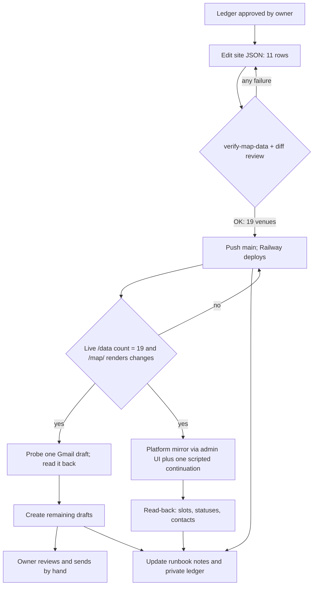

# Pre-Event Lineup Reconciliation 2026 - Plan

**Target repos:** `porchfest` (this repo, the platform) and `sapporchfest-site` (the marketing site; paths under it are written `site:`).

## Goal Capsule

- **Objective:** On the evening of 2026-09-16 every host and every act knows where and when they play, the public map at `https://sapporchfest.org/map/` shows the same lineup they were told, and the platform holds matching records so the post-event cutover can lock the season without losing anyone.
- **Means:** Reconcile Gmail and the Forms sheet into one approved change ledger, bridge the approved changes onto the site map by hand-editing its data file (KTD1), mirror them into the platform admin (KTD2), then create per-venue reply-all Gmail drafts the owner sends by hand (KTD3, KTD4).
- **Authority:** The owner decides every placement (R2). Where this plan and a runbook disagree, the runbook wins on procedure and this plan wins on which changes are approved. Where the plan and the owner's inline answers disagree, the answers win.
- **Stop conditions:** Stop and ask before any write not listed in the change ledger; before withdrawing a venue record; before sending any email; if the live map count after push differs from the expected 19; if the platform admin shows a record whose state contradicts the ledger. If the live map cannot be verified before the owner's evening review, the drafts are still created with the lineup text authoritative and the map described as updating shortly (owner's 2026-09-14 answer).
- **Execution profile:** Runs to completion in one working session on 2026-09-14 or 09-15; the drafts must exist before the owner's evening review on 09-15.
- **Who finishes:** Claude subagents do the Gmail and Drive work and the admin-UI mirror (Codex has no network); a Codex worker may do the site JSON edit; the orchestrator verifies every artifact; the owner sends the emails.

---

## Product Contract

### Summary

Two days before the event, gather every lineup change that arrived since the 2026-08-22 import cutoff, get the owner's approval on each, publish the result to the public map and the platform, and leave one review-ready Gmail draft per venue plus one to the unplaced performer. Nothing is sent by an agent.

### Problem Frame

The public map and the platform were both filled from a 2026-08-22 export, then patched by hand twice. Since then eleven threads and three sheet rows have changed the lineup: one band was placed at the wrong porch by the 09-06 fallback rule, two acts were swapped for other bands, one act was added, one act withdrew leaving its porch empty, one act's hours were misrecorded, one host household changed who is hosting, and one new host and one unplaced performer are waiting. Six of those inbound messages are still unanswered. The owner has already sent a "you're matched!" email to most porches, so every participant expects the map to be right and expects any change to arrive on the thread they already have.

### Requirements

**Reconciliation**

- R1. Every lineup-affecting message in Gmail dated after 2026-08-22 and every Forms row with a 2026 timestamp after 2026-08-22 is reflected in one change ledger, with the evidence that supports each row.
- R2. No placement, slot change, or withdrawal is published anywhere until the owner has approved that specific row; the four rows answered on 2026-09-14 are recorded under Key Decisions.
- R3. The ledger's contact data (emails, phones) lives only in the private operational record, never in either repository.

**Public map**

- R4. `site:static/data/venues-2026.json` reflects the approved ledger exactly: the changes in the Change Ledger below and nothing else.
- R5. The edited file passes `tools/verify-map-data.py`, follows the runbook's conventions the validator cannot check (en dashes in `schedule` and `slot_label`, link labels only `Listen` or `Website`, no empty `acts`, `schedule` matching the acts' hours), and leaves the schema pin and `schema_version` untouched.
- R6. Publication is proven by the live data endpoint returning 19 venues and by the rendered `/map/` showing each changed venue's new lineup, not by the push alone.

**Platform mirror**

- R7. Every approved change exists in the production platform in the same session: withdrawn acts are `withdrawn` with their slots released, moved and added acts are assigned to the right slots, and the two-hour act is assigned the way existing two-hour acts are.
- R8. Withdrawals are mirrored in both directions so the site lineup and the platform lineup agree act for act, per the cutover precondition.
- R9. The venue record for a porch that lost its act stays active unless the owner says otherwise (his 2026-09-14 answer for 1040 Bayless, and his 2026-09-08 answer for 2379 Bourne).

**Drafts**

- R10. One Gmail draft exists per venue on the map, per act-less host still willing to host, and one to the unplaced performer; each is a reply-all on that group's most recent thread so it lands in the participants' existing conversation.
- R11. Each venue draft names the final lineup with hours, the venue's logistics from the forms, every person's role, and asks for a reply-all confirmation; a draft for a changed venue says plainly what changed.
- R12. Drafts are plain text and carry the map link as the bare URL `https://sapporchfest.org/map/` with no HTML wrapping.
- R13. Recipients are derived from the ledger's current contacts, not from the thread's last recipient list, so a changed host or a missing participant is on the draft.
- R14. The performer draft asks, politely and with urgency, that the requested host complete the host form, and states the two outcomes: without the form the porch is not on the map or schedule, and if the host is not interested the organizer is glad to place the performer with another host.
- R15. No agent sends, replies, labels, or trashes anything in Gmail; drafts only.

**Record**

- R16. The cutover runbook's precondition notes and the bridge runbook's worked examples reflect what was done, and the private ledger records every owner decision.

### Key Decisions

- **Late submissions bridge onto the marketing-site map by hand-editing its data file** (session-settled: user-directed — chosen over locking the season early and over freezing the map: an early lock is irreversible and closes open slots; a frozen map omits valid late entries). Governs R4, R5, R6.
- **The owner decides every placement; no guessed placement is published** (session-settled: user-directed — chosen over applying the 2026-09-06 fallback rule autonomously: the fallback rule is a proposal rule, not authority). Governs R2, R9, R14.
- **Website scope is the public map plus the platform mirror** (session-settled: user-approved — chosen over map-only: the cutover precondition requires the platform to hold every bridged record before lock). Governs R7, R8.
- **A draft for every venue, not only changed ones** (session-settled: user-approved — chosen over drafts for changed or unemailed venues only: two days out, every group benefits from a final-details message). Governs R10, R11.
- **Drafts are reply-all on the existing thread with a bare map URL** (session-settled: user-directed — chosen over fresh threads and HTML bodies: recipients should see the message in their existing correspondence, and link-wrapping markup reads as spam). Governs R10, R12.
- **The unplaced performer gets a polite, urgent ask rather than a placement** (session-settled: user-directed — chosen over proposing a fallback porch: consent must come from the host, and the performer chose that household). Governs R14.
- **The O'Keefe Brothers move to 960 Hampden 6–7 pm; 1528 Grantham keeps Loose Rooster 7–8 pm only** (session-settled: user-directed — chosen over leaving the map as bridged on 09-06: the band and the 960 Hampden host both wrote on 09-13 that the map is wrong). Governs R4, R7.
- **2382 Doswell: Professor Tolzmann's Mechanical Music Machine plays 6–8 pm** (session-settled: user-directed — chosen over 6–7 only: the performer's form asks for two hours; the draft confirms with the host). Governs R4, R7.
- **1040 Bayless leaves the map and stays active in the platform** (session-settled: user-directed — chosen over withdrawing the venue: there is no unassigned performer to place today, and a late sign-up may still need a porch). Governs R4, R9.
- **1399 Raymond: Larkspur plays 6–7 pm; 7–8 is open** (session-settled: user-directed — chosen over keeping 6–8: the band confirmed one hour). Governs R4, R7.
- **2227 Scudder: Twist My Arm replaces Scudder Strings at 7–8 pm** (session-settled: user-approved — the owner asked whether a conflict existed; none does, because the host, Scudder Strings, and Twist My Arm are the same person swapping his own bands; chosen over asking the group to resolve a conflict). The draft still asks the group to confirm. Governs R4, R7.
- **Drafts go out even if the live map cannot be verified in time** (session-settled: user-directed — chosen over holding the drafts: recipients get the correct lineup by email and the map follows). Governs R6, R10.

### Scope Boundaries

- Season lock, map publication in the platform, the site's U12 pull request, and the retirement of the Forms all stay after the event, per the cutover runbook.
- The platform's own email waves are not used; the owner asked for Gmail drafts he reviews.
- SPF or DMARC changes for the sending domain are out.
- The cockpit board, on-deck list, and Decision Sheets are not touched while the cockpit freeze sentinel exists.
- The cookie-donation offer from a local bakery (unanswered since 2026-09-09) is not a lineup item; it is listed for the owner under Outstanding Questions and gets no draft unless he asks.
- 2379 Bourne stays as decided on 2026-09-08: act withdrawn in the platform (done in U3 if not already), venue record kept. The host's 2026-08-23 message said the property cannot host another band, so no one is placed there without fresh consent.

#### Deferred to Follow-Up Work

- Placing Samuel Wilbur, or any late performer, once a host consents: candidates with power and no act are 1040 Bayless, 2101 Scudder, 2129 Como, the 6–7 slot at 1528 Grantham, and the 7–8 slot at 1399 Raymond. Each needs the owner's call and the bridge runbook again.
- A performer draft for 2129 Como's host once an act exists; today she gets a welcome-and-status note only.
- Optional validator hardening in the site repo (expected-count flag, duplicate slot check, schedule-versus-slot consistency).

### Outstanding Questions

None block execution. For the owner's attention, not this plan's:

- The bakery's cookie-donation offer needs a yes or no.
- Ryan Rentmeester asked whether to list Twist My Arm as starting about 6:45 rather than 7:00; the map keeps 7–8 pm and the draft mentions the early start.
- Whether the 2379 Bourne venue record should stay active given the host's 2026-08-23 message; the 2026-09-08 decision stands unless he changes it.

Review proposals the owner has not yet confirmed; the executor applies none of them without his word but should not be surprised by the gaps they name:

- R10 says every draft is a reply-all on an existing thread, while U4 starts a new thread for a host with no prior conversation; treat the new thread as the intended behavior for that case and record its id.
- The approval gate in R2 does not name host-contact changes; the executor takes a host contact only from the host's own form row or message.
- U1 does not require recording the searches run and their counts; recording them is cheap and recommended.
- A re-run with drafts already present should inventory existing drafts per group and reuse an exact match rather than refuse or duplicate.
- The in-container SQLite copy has no named path, mode, or deletion step; write it outside the served data volume, mode 600, and delete it after the read-back.
- Link URLs in the map data should start with http or https, not merely any scheme.

### Sources

- Gmail: eleven threads read in full on 2026-09-14; the per-thread extraction, participants, and most recent message ids are in the private ledger (R3).
- Forms sheet "SAP Porchfest Performers and Hosts": host tab and performer tab parsed by 2026 timestamp; three rows after 2026-08-27 (a host at 2129 Como on 09-09, performer forms for Professor Tolzmann on 09-08 and The Nine Teas on 09-09).
- `docs/operations/late-submissions-map-bridge.md` (procedure, conventions, withdrawals), `docs/operations/post-event-cutover-2026.md` (preconditions), `docs/operations/organizer-recovery.md` (sign-in link), `docs/solutions/workflow-issues/point-repo-state-audits-at-git-refs-not-the-shared-working-tree.md`, `docs/solutions/workflow-issues/worker-dispatch-fails-silently-outside-the-target-repo.md`, `docs/solutions/conventions/mutation-testing-for-silent-guard-failures.md`.
- `site:tools/verify-map-data.py` and `site:static/data/venues-map.v1.schema.json` (what the validator does and does not check).
- Platform admin routes in `packages/web/src/routes/admin-records.ts`, `packages/web/src/routes/assign.ts`, `packages/web/src/routes/coordinates.ts`; withdrawal semantics in `packages/core/src/season.ts` (`setRecordStatus` reopens held slots in one transaction).

---

## Planning Contract

### Change Ledger

Public-safe view (names and addresses are already on the public map). Contacts, thread ids, and message ids are in the private ledger.

| # | Venue | Change | Map edit | Platform action | Evidence |
|---|---|---|---|---|---|
| 1 | 960 Hampden Ave | Add The O'Keefe Brothers 6–7 pm (moved from 1528 Grantham); host is now Bruce Weber | Move the act object; `schedule` 7–8 pm → 6–8 pm | Assign act 34 to the 6–7 slot; update host contact | Band 09-13, Phil Carlson 09-13, host household 09-10 |
| 2 | 1528 Grantham Street | Remove The O'Keefe Brothers 6–7 pm; Loose Rooster 7–8 pm stays | Drop the act; `schedule` → 7–8 pm | Unassign act 34 from slot 51 (leave open) | Same as row 1 |
| 3 | 2382 Doswell Ave. | Lonely Loons out; Professor Tolzmann's Mechanical Music Machine 6–8 pm (acoustic street organ) | Replace the act; `slot` 6-8, `schedule` → 6–8 pm | Withdraw Lonely Loons act; placeholder act; assign both slots as existing two-hour acts are | Host 09-08, performer form 09-08, owner 09-14 |
| 4 | 2268 Knapp St. | Add The Nine Teas 6–7 pm; Rainbow County School Board 7–8 pm stays | Add the act; `schedule` → 6–8 pm | Placeholder act; assign the 6–7 slot | Thread 09-09 to 09-13 (owner wrote "locked in"), performer form 09-09 |
| 5 | 2227 Scudder St | Scudder Strings out; Twist My Arm 7–8 pm (may start about 6:45) | Replace the act with description, genre, and one `Website` link | Withdraw Scudder Strings act; placeholder act; assign the 7–8 slot | Host and bandleader 09-08 (same person); owner 09-14 |
| 6 | 1040 Bayless Avenue | Switchgrass withdrew; no act | Remove the venue object | Withdraw Switchgrass act; keep venue active | Band 09-12, owner 09-14 |
| 7 | 1399 Raymond Ave | Larkspur plays 6–7 pm only | `slot` 6-7, `slot_label` and `schedule` → 6–7 pm | If assigned to both slots, unassign the 7–8 slot | Band 08-24, owner 09-14 |
| 8 | 2379 Bourne Ave. | Already off the map; act withdrawal not yet mirrored | None | Withdraw Crazy Chester act if still active; keep venue | Cutover checklist open item |
| 9 | 2161 Doswell Ave | No lineup change; the host was never on the thread | None | Correct the host contact if the platform carries the duo member's address | Duo member 08-22 |
| 10 | 2129 Como Ave | New host, no act | None (act-less venues are never published) | None today | Host form 09-09 |
| 11 | 2101 Scudder St | Act-less since 08-20; host still willing | None | None | Host 09-11, owner 09-13 |

Expected result: 19 venues, 26 acts (three acts out, three in, one moved).

### Key Technical Decisions

- KTD1. **Hand-edit the site data file per the bridge runbook; one commit for all rows.** A single `data(map):` commit means the live map never shows a half-reconciled lineup, and the runbook's diff review catches what the validator cannot (R5). The edit may run as a Codex worker launched from inside the site checkout, or inline; the orchestrator verifies by diff and validator either way. The wrapper's out-file is never the data file: `codex-run.sh` deletes its out-file before every dispatch, so the out-file is an untracked worker report inside the site checkout (at least 400 bytes), and the bridge runbook's contrary advice is corrected in U5.
- KTD2. **Mirror through the admin UI, with one documented exception.** Placeholder, assign, unassign, and status routes exist for every ledger action except two: the admin assign route cannot create the second half of a two-hour assignment (core requires a continuation option only the importer passes), and no route re-points a venue's host contact to a different person. The two-hour half is created by one scripted call to core's assign operation with the continuation option, piped into the running app container the way the 2026-09-07 handoff records; a host change is an in-place edit of the venue's existing contact record. `setRecordStatus` releases a withdrawn act's slot in the same transaction. Before every write, read the record's current state; after, read it back. A zero-downtime SQLite copy is taken inside the app container first, as on 2026-09-07. No `deploy/archive.sh`.
- KTD3. **Drafts are created through the Gmail connector as replies to a chosen message on the group's thread, with recipients and subject set explicitly from the ledger.** The connector takes a reply-target message id plus explicit To and Cc lists (recipients are never inherited), a subject that defaults to empty unless passed, and appends the new body to the original message's body. So every draft passes the subject as `Re:` plus the thread's subject, and the quoted original is chosen, not accepted blindly: when the recipient set includes anyone who was not on the thread, the reply target must be a message whose quoted text carries no contact detail or third-party remark that person has not already seen; otherwise reply to the owner's own most recent message or start a new thread and record it. The first draft is a probe verified by reading it back before the rest are created (R10, R13).
- KTD4. **Plain-text bodies only.** No HTML body is passed, so the map URL stays a bare link (R12). The body follows the owner's own "you're matched!" structure: match, venue, people, gear and logistics, please do this, map link, sign-off.
- KTD5. **Sequence is ledger → site → drafts → platform, all in one session.** A draft must not point at a map that does not yet show what the draft says, so drafts wait for the verified live map. The platform mirror depends on nothing a draft says and needs production access, so it runs last rather than gating the deadline-critical drafts; it still runs in the same session so the cutover precondition never silently lapses.
- KTD6. **Idempotency by pre-state assertion.** Objects in the JSON have no ids and the platform has no swap primitive, so every step first asserts the state it expects (venue count 20, act present or absent, slot open or assigned, draft absent) and refuses to proceed otherwise.
- KTD7. **Contact data stays out of both repositories.** The ledger with emails, phones, thread ids, and message ids lives under the private handoff store; the repo copy of this plan and the runbook updates carry names and addresses only (R3).

### High-Level Technical Design

### Assumptions

- The Gmail connector's reply-target parameter threads the draft under the original thread; the probe in U4 confirms this before bulk creation.
- The performer forms for The Nine Teas and Professor Tolzmann arrived (both are in the sheet); The O'Keefe Brothers' form arrived 08-24.
- Existing two-hour acts in the platform are one act with a base assignment on the first slot and a continuation assignment on the adjacent slot, the shape the importer creates; U3 reads one such venue first and reproduces it.

---

## Implementation Units

### U1. Reconciliation ledger and private record

- **Goal:** One approved ledger with every change, its evidence, its contacts, and the owner's decisions, stored privately.
- **Requirements:** R1, R2, R3
- **Dependencies:** none
- **Files:** private handoff store `~/.local/state/ce-handoffs/porchfest/2026-09-14-lineup-ledger.md` (mode 600, outside git); scratch inputs are the Gmail extraction and the parsed sheet from this session.
- **Approach:**
  1. Carry the Change Ledger rows into the private file with per-venue host and act contacts from the sheet, thread ids, and most recent message ids.
  2. Add the per-venue logistics fields the drafts need (space, power, rain plan, gear, drinks, amenities, notes) for all 19 map venues plus the three act-less hosts.
  3. Mark each row's approval source (owner answer of 2026-09-14, or "no change").
- **Patterns to follow:** the bridge runbook's evidence rule (host response, performer response, owner approval per change).
- **Test scenarios:**
  - Every map venue has a host contact and every act on the map has an act contact in the ledger; a venue with neither is flagged, not silently skipped.
  - A map venue with no 2026 host-form row (the owner's own porch, and 2161 Doswell) is flagged and its logistics are sourced from the owner's earlier match email or marked unknown in the draft, never invented.
  - Every ledger row cites at least one evidence item with a date.
  - The file is not inside any git working tree and has mode 600.
- **Verification:** The ledger lists 19 map venues, 3 act-less hosts, 1 unplaced performer, and the 11 change rows; no email address appears in any repo file touched by this plan.

### U2. Site map data edit, validation, publication

- **Goal:** The public map shows the approved lineup.
- **Requirements:** R4, R5, R6
- **Dependencies:** U1
- **Files:** `site:static/data/venues-2026.json`; read-only: `site:tools/verify-map-data.py`, `site:tools/test_verify_map_data.py`, `site:static/data/venues-map.v1.schema.json`.
- **Approach:**
  1. Confirm the site checkout is clean, on `main`, at the remote tip; read the baseline from the git ref, not the working tree; assert 20 venues and 26 acts.
  2. Apply ledger rows 1–7 following each existing object's key order and conventions; recompute `schedule` for every touched venue.
  3. New act objects: Twist My Arm (description and genre from the bandleader's message, one `Website` link), Professor Tolzmann's Mechanical Music Machine (description and genre from the form, no links), The Nine Teas (description from the thread, genre alternative rock, `Website` links from the form with the scheme added).
  4. Run the validator's unit tests and the validator; review the diff row by row against the ledger; confirm the schema pin and `schema_version` are unchanged.
  5. Commit as one `data(map):` commit naming each change; push `main`; wait for the deploy.
  6. Fetch the live data with a cache-busting query and count venues; load `/map/` in the browser and confirm each changed venue's card and pin.
- **Execution note:** If a Codex worker does the edit, launch it from inside the site checkout and give the wrapper an untracked report file as its out-file, never the data file (the wrapper deletes the out-file before each dispatch); a `VERIFY-FAIL` from the wrapper is not evidence of no work — check the diff.
- **Patterns to follow:** site commits `4dd52e7` (venue added by hand) and `f0d87df` (venue removed because its only act withdrew).
- **Test scenarios:**
  - Validator prints `OK: 19 venues`; the unit-test module passes.
  - The diff touches exactly the seven venues in rows 1–7 and no other object; the 1040 Bayless object is gone; no venue has an empty `acts` array.
  - Every touched venue's `schedule` equals the span of its acts' `slot_label` values (960 Hampden 6–8, 1528 Grantham 7–8, 2382 Doswell 6–8, 2268 Knapp 6–8, 2227 Scudder 6–8, 1399 Raymond 6–7).
  - Every `slot` uses a hyphen, every `slot_label` and `schedule` an en dash; every link label is `Listen` or `Website`; every link URL starts with a scheme.
  - Re-running the edit against the already-edited file refuses because the pre-state assertion (20 venues) fails.
  - Live data endpoint returns 19 venue objects; the rendered map lists The O'Keefe Brothers under 960 Hampden and not under 1528 Grantham, shows Professor Tolzmann at 2382 Doswell 6–8 pm, The Nine Teas at 2268 Knapp 6–7 pm, Twist My Arm at 2227 Scudder 7–8 pm, Larkspur 6–7 pm, and no 1040 Bayless pin.
- **Verification:** Live count and rendered map match the ledger; the commit is on `main` and the checkout is clean.

### U3. Platform mirror

- **Goal:** The production platform holds the same lineup as the site, act for act.
- **Requirements:** R7, R8, R9
- **Dependencies:** U2 and U4 (KTD5 fixes the order: the mirror runs last in the same session; its own writes need neither the push nor the drafts, so a failure here never blocks them)
- **Files:** no repo files; production admin UI at `app.sapporchfest.org`; read-only references: `packages/web/src/routes/admin-records.ts`, `packages/web/src/routes/assign.ts`, `packages/web/src/routes/coordinates.ts`, `packages/core/src/season.ts` (the assign operation and its continuation option), `docs/operations/organizer-recovery.md`.
- **Approach:**
  1. Take a zero-downtime SQLite copy inside the app container. Generate the organizer sign-in link server-side and open it in the isolated browser as immediately consecutive steps; it is single-use and expires in an hour, so confirm redemption (a second open is refused), never copy it into the ledger, a task spec, a handoff, a report, or a commit, and sign out at the end of the unit.
  2. Inspect one existing two-hour venue's assignments to confirm the base-plus-continuation shape for a 6–8 act.
  3. Rows in order: 2, 1 (unassign act 34 from Grantham slot 51, then assign it to 960 Hampden's 6–7 slot; for the host change, edit the venue's existing host contact record in place with name, email, and phone after confirming it is not also an act's contact, and record the prior values in the private ledger), 3 (withdraw Lonely Loons; placeholder act with the performer's contact from the sheet; assign the 6–7 slot through the admin UI, then create the 7–8 half by one scripted call to core's assign operation with the continuation option naming the 6–7 slot, piped into the running app container; read back the act page's "Continues in" line), 4 (placeholder act; assign 6–7), 5 (withdraw Scudder Strings; placeholder act; assign 7–8), 6 (withdraw Switchgrass; leave venue active), 7 (if Larkspur holds both slots, unassign the 7–8 continuation from the venue's assign page so the 6–7 base assignment survives; confirm on the act page), 8 (withdraw Crazy Chester if still active), 9 (if the platform's host contact for 2161 Doswell carries the duo member's address, edit that contact record in place the same way as row 1).
  4. Read back each touched venue's slots and each act's current assignment; sign out.
  5. Record the expected publishable venue count for the cutover checklist (active, non-superseded, verified coordinate, at least one assigned act).
- **Patterns to follow:** the 2026-09-07 Grantham entry recorded in `docs/handoffs/2026-09-07-grantham-entered-cutover-pending.md`; the withdrawal rule in the bridge runbook.
- **Test scenarios:**
  - Before each write the record's version and state match the ledger's expectation; a mismatch stops the unit.
  - After row 2, Grantham slot 51 reads open and act 34 has no assignment; after row 1, act 34's current assignment is 960 Hampden 6–7.
  - Withdrawing an act releases its slot in the same operation (slot reads open immediately).
  - A withdrawn act cannot be assigned (attempting it is refused), so no withdrawn act remains in any slot.
  - Professor Tolzmann's act shows a base assignment on 6–7 and a continuation on 7–8, the same shape as an existing 6–8 act; the scripted call is refused if the act is already assigned elsewhere.
  - After row 7, Larkspur's 6–7 assignment still exists and the 7–8 slot reads open.
  - Re-opening the consumed sign-in link is refused.
  - Venue records for 1040 Bayless and 2379 Bourne remain active with open slots.
  - The public health endpoint stays healthy throughout; no restart occurs.
- **Verification:** A read-only query over the production database lists, per venue, the assigned non-withdrawn acts and matches the site JSON act for act; the sign-in link was consumed and the session signed out.

### U4. Gmail drafts

- **Goal:** One review-ready draft per group in the owner's Drafts folder, threaded on the existing conversation, nothing sent.
- **Requirements:** R10, R11, R12, R13, R14, R15
- **Dependencies:** U1, U2 (map verified live)
- **Files:** none in either repo; the draft bodies are composed from the ledger. The subagent's brief names its tool set: draft creation (with the reply-target parameter) is the only write; draft read-back, draft listing, thread search, and thread read are the reads; send, reply, forward, label, spam, trash, and edits of pre-existing drafts are out of scope.
- **Approach:**
  1. Probe: create the 960 Hampden draft first as a reply to the message chosen per KTD3 (the group's thread already includes the new host contact, so its most recent message qualifies), with To and Cc set from the ledger (host, the new host contact, both acts) and the subject passed explicitly. Read it back: thread id matches, recipients are exactly the ledger's set, subject is `Re:` plus the thread's subject, the authored portion above the quoted original is plain text with the bare URL, and the quoted original carries nothing a newly added recipient should not see. Fix the creation shape before continuing.
  2. Create the remaining venue drafts in this order: 1528 Grantham, then the other changed venues (2382 Doswell, 2268 Knapp, 2227 Scudder, 1399 Raymond), then unchanged venues, then act-less hosts (1040 Bayless with the host and the withdrawn band's members, 2101 Scudder, 2129 Como), then Samuel Wilbur. For a venue with no prior thread, find the group's most recent thread by address and participants; if none exists, create a new thread and note it in the ledger.
  3. Body shape per venue: greeting by first names; two-days-out framing; "THE LINEUP" with hours, marking any change with what changed and why; "VENUE" and "GEAR & LOGISTICS" from the host form; "PEOPLE" with names and roles (contact details only where the owner's earlier email already shared them on that thread); "PLEASE DO THIS" asking for a reply-all confirmation as soon as they see it and by noon on Wednesday 09-16 at the latest; the bare map URL; the owner's sign-off.
  4. Changed-venue specifics: 960 Hampden states the trio opens for Phil, the host is Bruce, load-in at 5 pm; 1528 Grantham states the 6–7 slot is open, that the organizer is still looking, and that the host should not book it independently but is welcome to suggest a performer; 2382 Doswell confirms the street organ for both hours and asks the host to confirm; 2268 Knapp confirms The Nine Teas at 6–7 and the outlet request; 2227 Scudder confirms Twist My Arm at 7–8 with the possible 6:45 start; 1399 Raymond confirms 6–7 and thanks the band for the offer to extend; 1040 Bayless thanks the band, tells the host the porch is off the map, and asks whether she would host a late act.
  5. Samuel Wilbur draft: reply on the 09-06 thread; warm, urgent; ask that the household complete the host form today (bare form URL), spell out both outcomes from R14, and offer to place him with another willing host if that suits everyone.
  6. Run a draft-listing check: expected count, each draft's thread id, no message in Sent after the session started.
- **Patterns to follow:** the owner's 2026-09-06 "you're matched!" email to 1476 Chelmsford (structure and tone) and his 2026-09-06 note to Samuel Wilbur.
- **Test scenarios:**
  - The 960 Hampden probe draft's thread id equals the target thread's id, its subject is `Re:` plus that thread's subject, and its recipients equal the ledger set including the added host contact.
  - The later 2161 Doswell draft's recipients include the host's own address rather than the duo member's, per R13, and its quoted original carries no contact detail the host has not already seen.
  - The authored portion of every draft above the quoted original contains `https://sapporchfest.org/map/` as bare text and no HTML tags; no HTML body was passed.
  - Draft count equals 19 map venues + 3 act-less hosts + 1 performer = 23; a re-run does not create a second draft for a group that already has one.
  - Every changed venue's draft states its change in one sentence a recipient could act on.
  - No message dated after the session start appears in Sent; no label or trash operation occurred.
- **Verification:** The owner opens Drafts and sees 23 threaded drafts whose recipients and lineups match the ledger; he sends them himself.

### U5. Records and runbook updates

- **Goal:** The repositories and the private store say what happened, so the cutover session starts from truth.
- **Requirements:** R16
- **Dependencies:** U2, U3, U4
- **Files:** `docs/operations/post-event-cutover-2026.md` (precondition status notes for the bridge and withdrawal items), `docs/operations/late-submissions-map-bridge.md` (a second worked example: the 09-06 fallback placement reversed on owner evidence; the 2026-09-14 withdrawals), `docs/handoffs/2026-09-07-grantham-entered-cutover-pending.md` (retire into the runbooks), private ledger from U1 (append outcomes), memory file `pending-for-damien-2026-09-02.md` (update the Wilbur item).
- **Approach:**
  1. Replace the two stale status notes in the cutover preconditions with the 2026-09-14 state and the new expected venue count.
  2. Add the worked example and withdrawal records to the bridge runbook with site commit ids, names, and addresses only, and correct its operational-traps advice: the wrapper's out-file must be a separate report file, never the deliverable, because `codex-run.sh` deletes the out-file before each dispatch.
  3. Retire the 09-07 handoff with a commit message naming the runbooks that absorbed it.
- **Patterns to follow:** existing status-note style in the cutover checklist; the runbook's "Recorded withdrawal — 2026-09-08" entry.
- **Test scenarios:** Test expectation: none -- documentation only; the privacy scan is the check (no email address or phone number in the diff).
- **Verification:** `git diff` of the docs shows names and addresses only; the handoff file is deleted and its content is recoverable from history.

---

## Verification Contract

| Gate | Command or check | Applies to | Pass signal |
|---|---|---|---|
| Site validator tests | `python3 -m unittest tools/test_verify_map_data.py` in the site checkout | U2 | all tests pass |
| Site validator | `python3 tools/verify-map-data.py` in the site checkout | U2 | prints `OK: 19 venues` |
| Diff review | `git diff -- static/data/venues-2026.json` read against the Change Ledger | U2 | only rows 1–7 touched; conventions in R5 hold |
| Live publication | fetch `https://sapporchfest.org/data/venues-2026.json?v=<stamp>` and count venues; screenshot `/map/` | U2 | 19 venues; changed cards and pins render |
| Platform read-back | admin pages for each touched venue and act; read-only DB query of assigned non-withdrawn acts per venue | U3 | matches the site JSON act for act |
| Platform health | `curl -s -o /dev/null -w '%{http_code}' https://app.sapporchfest.org/health` | U3 | 200 before and after |
| Drafts | Gmail draft listing filtered to the session; read-back of the probe draft | U4 | 23 drafts; thread ids, subjects, and recipients match the ledger; Sent unchanged |
| Privacy | `git diff` of every repo file touched, scanned for `@` and phone patterns | U1, U5 | no matches |

---

## Definition of Done

- All 11 ledger rows are applied on the site (rows 1–7), in the platform (rows 1–9), and reflected in the drafts.
- The live map shows 19 venues and every changed lineup; the platform matches it act for act; expected cutover venue count recorded.
- 23 drafts exist, threaded and plain text, with the bare map URL; the performer draft carries both outcomes; nothing was sent by an agent.
- Runbook notes are current, the 09-07 handoff is retired, the private ledger holds every decision and contact, and no contact data entered either repository.
- Scratch files from this session that hold contact data are deleted or moved into the private store.
